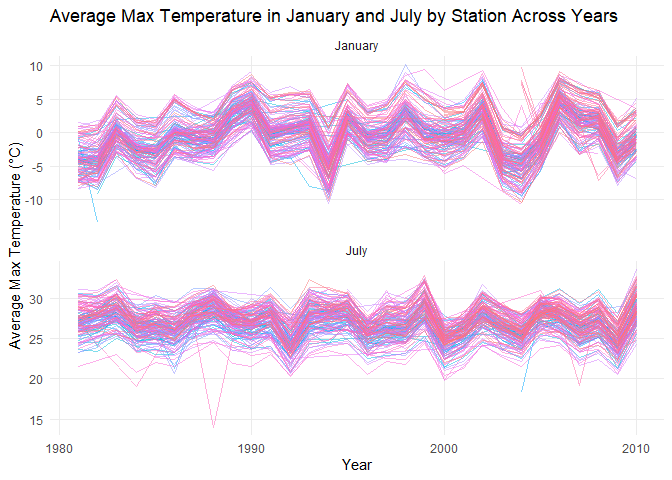
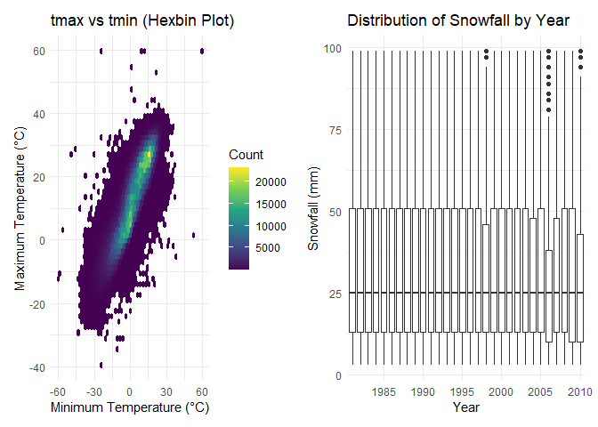
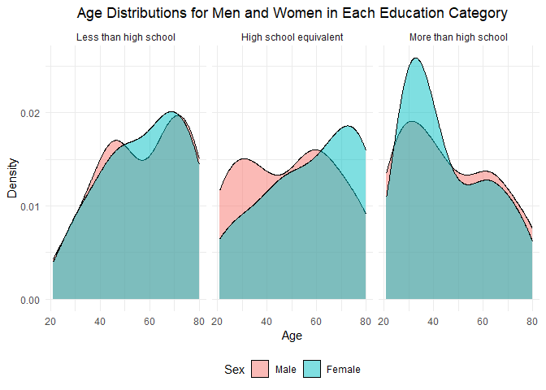
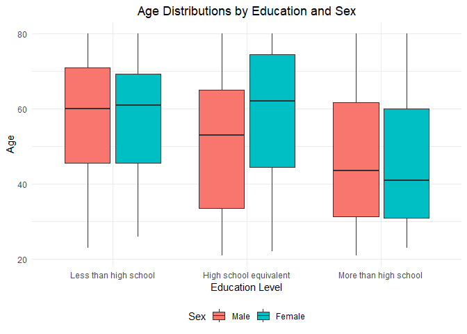
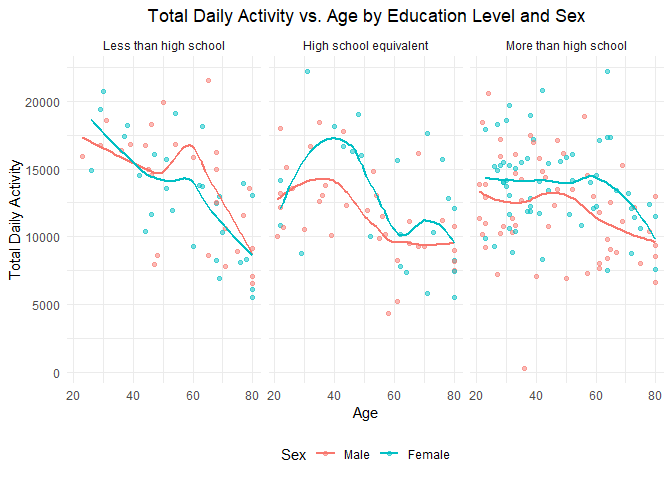
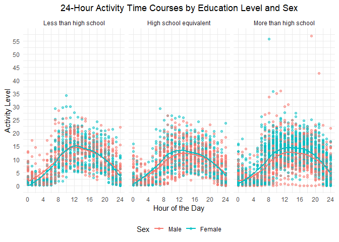
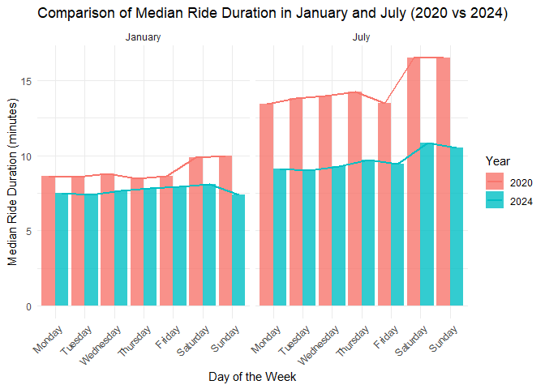
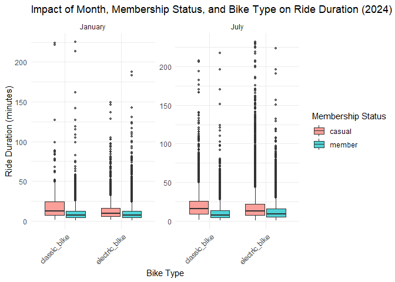

p8105_hw3_sg4489
================
sg4489
2024-10-10

``` r
library(tidyverse)
library(gt)
library(ggplot2)
```

# Problem 1

### Load and describe the raw dataset:

First, I load the dataset: ny_noaa, ensure it is fully evaluated and
loaded, and check the head of data to see the basic structure of the
data.

``` r
# Load the p8105.datasets package
library(p8105.datasets)

# Load the datasets: nyc_airbnb and rest_inspec
data("ny_noaa")

# Use force() to ensure that the dataset is fully evaluated and loaded
ny_noaa <- force(ny_noaa)
```

Then, convert the data to dataFrame for next processing.

``` r
# Convert to dataFrame
ny_noaa_df <- as.data.frame(ny_noaa)

# View the structure of the data frame
glimpse(ny_noaa_df) 
```

    ## Rows: 2,595,176
    ## Columns: 7
    ## $ id   <chr> "US1NYAB0001", "US1NYAB0001", "US1NYAB0001", "US1NYAB0001", "US1N…
    ## $ date <date> 2007-11-01, 2007-11-02, 2007-11-03, 2007-11-04, 2007-11-05, 2007…
    ## $ prcp <int> NA, NA, NA, NA, NA, NA, NA, NA, NA, NA, NA, NA, NA, NA, NA, NA, 3…
    ## $ snow <int> NA, NA, NA, NA, NA, NA, NA, NA, NA, NA, NA, NA, NA, NA, NA, NA, 3…
    ## $ snwd <int> NA, NA, NA, NA, NA, NA, NA, NA, NA, NA, NA, NA, NA, NA, NA, NA, 0…
    ## $ tmax <chr> NA, NA, NA, NA, NA, NA, NA, NA, NA, NA, NA, NA, NA, NA, NA, NA, N…
    ## $ tmin <chr> NA, NA, NA, NA, NA, NA, NA, NA, NA, NA, NA, NA, NA, NA, NA, NA, N…

This dataset contains variables:  
id: Weather station ID  
date: Date of observation  
prcp: Precipitation (tenths of mm)  
snow: Snowfall (mm)  
snwd: Snow depth (mm)  
tmax: Maximum temperature (tenths of degrees C)  
tmin: Minimum temperature (tenths of degrees C)

### Create separate variables for year, month, and day.

``` r
# Create new variables: year, month, and day by extracting them from the 'date' column
ny_noaa_clean <- ny_noaa_df %>% 
  mutate(
    year = year(date), 
    month = month(date), 
    day = day(date)
  )

# Check the first few rows to confirm the new columns have been added
head(ny_noaa_clean)
```

    ##            id       date prcp snow snwd tmax tmin year month day
    ## 1 US1NYAB0001 2007-11-01   NA   NA   NA <NA> <NA> 2007    11   1
    ## 2 US1NYAB0001 2007-11-02   NA   NA   NA <NA> <NA> 2007    11   2
    ## 3 US1NYAB0001 2007-11-03   NA   NA   NA <NA> <NA> 2007    11   3
    ## 4 US1NYAB0001 2007-11-04   NA   NA   NA <NA> <NA> 2007    11   4
    ## 5 US1NYAB0001 2007-11-05   NA   NA   NA <NA> <NA> 2007    11   5
    ## 6 US1NYAB0001 2007-11-06   NA   NA   NA <NA> <NA> 2007    11   6

### Ensure observations for temperature, precipitation, and snowfall are given in reasonable units.

By running glimpse(ny_noaa_df), I notice that tmax and tmin are chr type
variables instead of int type variables, so I need to convert them to
numbers.

``` r
# Because tmax or tmin are not numeric, convert them to numeric
ny_noaa_clean <- ny_noaa_clean %>%
  mutate(
    tmax = as.numeric(tmax),  # Convert tmax to numeric
    tmin = as.numeric(tmin),  # Convert tmin to numeric
    prcp = as.numeric(prcp)   # Convert prcp to numeric if necessary
  )

# Check the structure of the data again
glimpse(ny_noaa_clean)
```

    ## Rows: 2,595,176
    ## Columns: 10
    ## $ id    <chr> "US1NYAB0001", "US1NYAB0001", "US1NYAB0001", "US1NYAB0001", "US1…
    ## $ date  <date> 2007-11-01, 2007-11-02, 2007-11-03, 2007-11-04, 2007-11-05, 200…
    ## $ prcp  <dbl> NA, NA, NA, NA, NA, NA, NA, NA, NA, NA, NA, NA, NA, NA, NA, NA, …
    ## $ snow  <int> NA, NA, NA, NA, NA, NA, NA, NA, NA, NA, NA, NA, NA, NA, NA, NA, …
    ## $ snwd  <int> NA, NA, NA, NA, NA, NA, NA, NA, NA, NA, NA, NA, NA, NA, NA, NA, …
    ## $ tmax  <dbl> NA, NA, NA, NA, NA, NA, NA, NA, NA, NA, NA, NA, NA, NA, NA, NA, …
    ## $ tmin  <dbl> NA, NA, NA, NA, NA, NA, NA, NA, NA, NA, NA, NA, NA, NA, NA, NA, …
    ## $ year  <dbl> 2007, 2007, 2007, 2007, 2007, 2007, 2007, 2007, 2007, 2007, 2007…
    ## $ month <dbl> 11, 11, 11, 11, 11, 11, 11, 11, 11, 11, 11, 11, 11, 11, 11, 11, …
    ## $ day   <int> 1, 2, 3, 4, 5, 6, 7, 8, 9, 10, 11, 12, 13, 14, 15, 16, 17, 18, 1…

Now that I’ve confirmed that prcp, tmax, and tmin are all double
precision floating point numbers (dbl). Then I can safely convert units
of them.

``` r
# Convert tmax and tmin from tenths of degrees Celsius to degrees Celsius
# Convert prcp from tenths of millimeters to millimeters
ny_noaa_clean <- ny_noaa_clean %>% 
  mutate(
    tmax = tmax / 10, 
    tmin = tmin / 10, 
    prcp = prcp / 10
  )
```

I convert precipitation from tenths of mm and temperature from tenths of
degrees Celsius to mm and degrees Celsius; the original data for
snowfall is in mm, so no additional conversion is needed.  
This way, the observed values of temperature(tmax, tmin),
precipitation(prcp), and snowfall(snow) are given in reasonable units.

### For snowfall, what are the most commonly observed values? Why?

``` r
# Calculate the frequency of each value in the snow column
snow_frequency <- table(ny_noaa_clean %>% pull(snow))

#Find the value that appears most frequently
most_frequent <- names(which.max(snow_frequency))
```

I calculated that the most common snowfall is 0. But from the
summary(ny_noaa_df) above, I can see that there are also a lot of na, so
next I want to compare the number of na and 0.

``` r
# Count the number of 0 values in the snow column
zero_count <- sum(ny_noaa_clean %>% pull(snow) == 0, na.rm = TRUE)

# Count the number of NA values in the snow column
na_count <- sum(is.na(ny_noaa_clean %>% pull(snow)))

#Compare the counts
cat("Number of 0s:", zero_count, "\n")
```

    ## Number of 0s: 2008508

``` r
cat("Number of NAs:", na_count, "\n")
```

    ## Number of NAs: 381221

``` r
# Check which is larger
if (zero_count > na_count) {
  cat("There are more 0s than NAs.\n")
} else if (zero_count < na_count) {
  cat("There are more NAs than 0s.\n")
} else {
  cat("The number of 0s and NAs is equal.\n")
}
```

    ## There are more 0s than NAs.

In snowfall data, the most common observed value is often 0, and there
are several reasons for this:  
1. Snowfall mainly occurs in winter: In most regions, snowfall is
limited to the winter months. Outside of winter, snow is rare or
nonexistent, leading to a high number of days with no snowfall recorded
(0).  
2. Even in colder climates, snowfall doesn’t happen every day during the
winter. Snowfall events are relatively infrequent, so the majority of
days, even in winter, have no snowfall, contributing to the large number
of 0 values.  
3. Many weather stations consistently record data daily, even when there
is no precipitation. On days with no snowfall, a 0 is logged. This
frequent recording of 0 on non-snow days leads to its dominance in the
dataset.

Finally, rearrange column names to make the data more readable and
describe the processed data.

``` r
# Rearrange columns
ny_noaa_clean <- ny_noaa_clean %>%
  select(id, date, year, month, day, tmax, tmin, prcp, snow, snwd)  

# Displaying organized data
glimpse(ny_noaa_clean)
```

    ## Rows: 2,595,176
    ## Columns: 10
    ## $ id    <chr> "US1NYAB0001", "US1NYAB0001", "US1NYAB0001", "US1NYAB0001", "US1…
    ## $ date  <date> 2007-11-01, 2007-11-02, 2007-11-03, 2007-11-04, 2007-11-05, 200…
    ## $ year  <dbl> 2007, 2007, 2007, 2007, 2007, 2007, 2007, 2007, 2007, 2007, 2007…
    ## $ month <dbl> 11, 11, 11, 11, 11, 11, 11, 11, 11, 11, 11, 11, 11, 11, 11, 11, …
    ## $ day   <int> 1, 2, 3, 4, 5, 6, 7, 8, 9, 10, 11, 12, 13, 14, 15, 16, 17, 18, 1…
    ## $ tmax  <dbl> NA, NA, NA, NA, NA, NA, NA, NA, NA, NA, NA, NA, NA, NA, NA, NA, …
    ## $ tmin  <dbl> NA, NA, NA, NA, NA, NA, NA, NA, NA, NA, NA, NA, NA, NA, NA, NA, …
    ## $ prcp  <dbl> NA, NA, NA, NA, NA, NA, NA, NA, NA, NA, NA, NA, NA, NA, NA, NA, …
    ## $ snow  <int> NA, NA, NA, NA, NA, NA, NA, NA, NA, NA, NA, NA, NA, NA, NA, NA, …
    ## $ snwd  <int> NA, NA, NA, NA, NA, NA, NA, NA, NA, NA, NA, NA, NA, NA, NA, NA, …

#### Describe the cleaned data

``` r
# View summary statistics for each column
summary(ny_noaa_clean)
```

    ##       id                 date                 year          month       
    ##  Length:2595176     Min.   :1981-01-01   Min.   :1981   Min.   : 1.000  
    ##  Class :character   1st Qu.:1988-11-29   1st Qu.:1988   1st Qu.: 4.000  
    ##  Mode  :character   Median :1997-01-21   Median :1997   Median : 7.000  
    ##                     Mean   :1997-01-01   Mean   :1996   Mean   : 6.565  
    ##                     3rd Qu.:2005-09-01   3rd Qu.:2005   3rd Qu.:10.000  
    ##                     Max.   :2010-12-31   Max.   :2010   Max.   :12.000  
    ##                                                                         
    ##       day             tmax              tmin              prcp        
    ##  Min.   : 1.00   Min.   :-38.9     Min.   :-59.4     Min.   :   0.00  
    ##  1st Qu.: 8.00   1st Qu.:  5.0     1st Qu.: -3.9     1st Qu.:   0.00  
    ##  Median :16.00   Median : 15.0     Median :  3.3     Median :   0.00  
    ##  Mean   :15.73   Mean   : 14.0     Mean   :  3.0     Mean   :   2.98  
    ##  3rd Qu.:23.00   3rd Qu.: 23.3     3rd Qu.: 11.1     3rd Qu.:   2.30  
    ##  Max.   :31.00   Max.   : 60.0     Max.   : 60.0     Max.   :2286.00  
    ##                  NA's   :1134358   NA's   :1134420   NA's   :145838   
    ##       snow             snwd       
    ##  Min.   :  -13    Min.   :   0.0  
    ##  1st Qu.:    0    1st Qu.:   0.0  
    ##  Median :    0    Median :   0.0  
    ##  Mean   :    5    Mean   :  37.3  
    ##  3rd Qu.:    0    3rd Qu.:   0.0  
    ##  Max.   :10160    Max.   :9195.0  
    ##  NA's   :381221   NA's   :591786

1.  The dataset contains 2,595,176 observations and 7 variables,
    covering weather measurements from NOAA weather stations from 1981
    to 2010. The key variables recorded are daily precipitation,
    snowfall, snow depth, maximum temperature, and minimum temperature.
    Below is a summary of the structure and key variables.

2.  Key variables and their missing data:  
    *id*: Weather station ID.  
    *date*: Date of observation, ranging from 1981-01-01 to
    2010-12-31.  
    *prcp*: Precipitation (mm). There are significant missing values
    (NAs: 145,838), and the maximum recorded value is 2,286
    millimeters.  
    *snow*: Snowfall (mm). The most common value is 0, and the maximum
    recorded snowfall is 10,160 mm.  
    *snwd*: Snow depth (mm). The snow depth ranges from 0 to 9,195 mm,
    with significant missing values (NAs: 591,786).  
    *tmax*: Maximum temperature (degrees C) with many missing values
    (NAs: 1,134,358). The maximum value is 60.0, and the minimum is
    -38.9.  
    *tmin*: Minimum temperature (degrees C) with similar missing values
    as tmax (NAs: 1,134,420). The range is from -59.4 to 60.0 degrees.

3.  Summary: The dataset provides a rich collection of daily weather
    observations over a long time period but suffers from a high degree
    of missing data, especially in the temperature and snow-related
    variables. This will require careful handling and potentially
    imputing or filtering for missing values in any further analysis.

### Two-Panel Plot for Max Temperature in January and July

Now, I can create a two-panel plot showing the average max temperature
in January and July for each station across years. This will allow us to
observe any patterns or outliers.

``` r
# Filter for January and July, calculate average max temperature per station and year
jan_jul_temps <- ny_noaa_clean %>%
  filter(month %in% c(1, 7)) %>%  # Filter for January and July
  group_by(id, year, month) %>%
  summarise(mean_tmax = mean(tmax, na.rm = TRUE)) %>%  # Calculate average max temp
  ungroup()
```

    ## `summarise()` has grouped output by 'id', 'year'. You can override using the
    ## `.groups` argument.

``` r
# Create the two-panel plot using ggplot, fixing the degree symbol issue
ggplot(jan_jul_temps, aes(x = year, y = mean_tmax, color = id)) +
  geom_line(alpha = 0.5) +  # Line plot for each station
  facet_wrap(~ month, scales = "free_y", ncol = 1, labeller = as_labeller(c(`1` = "January", `7` = "July"))) +  # Separate panels
  labs(
    title = "Average Max Temperature in January and July by Station Across Years",
    x = "Year",
    y = "Average Max Temperature (\u00B0C)",  # Proper degree symbol
    color = "Station ID"
  ) +
  theme_minimal() +
  theme(legend.position = "none",  # Remove legend (too many lines)
        panel.grid.minor = element_blank())
```

    ## Warning: Removed 5640 rows containing missing values or values outside the scale range
    ## (`geom_line()`).

<!-- -->

Observable / interpretable structure:  
Yearly Consistency: Most stations exhibit stable temperatures across
years, with typical seasonal patterns.  
Geographic Variation: Differences between stations may reflect
geographic factors, such as coastal vs. inland locations, influencing
temperature extremes.

Outliers:  
Unusual Spikes/Dips: Sudden deviations, like extreme highs in January or
sharp drops in July, could indicate data errors or unusual weather
events (e.g., cold snaps, heatwaves).  
Missing Data: Gaps or incomplete records can also create apparent
outliers, disrupting the overall trend.

### Make a two-panel plot showing (i) tmax vs tmin for the full dataset.

A scatterplot for tmax vs tmin might not be ideal due to the large
amount of data. Instead, we can use a hexbin plot to handle the dense
data points. For the snowfall distribution, we will use boxplots to show
the distribution of snowfall values by year.

``` r
# 1. Plot tmax vs tmin using hexbin plot
tmax_tmin_plot <- ny_noaa_clean %>% 
  filter(!is.na(tmax) & !is.na(tmin)) %>%  # Filter out missing values
  ggplot(aes(x = tmin, y = tmax)) + 
  geom_hex(bins = 50) +  # Hexbin plot to handle dense data
  scale_fill_viridis_c() + 
  labs(
    title = "tmax vs tmin (Hexbin Plot)",
    x = "Minimum Temperature (\u00B0C)",  # Unicode for degree symbol
    y = "Maximum Temperature (\u00B0C)",  # Unicode for degree symbol
    fill = "Count"
  ) + 
  theme_minimal()

# 2. Distribution of snowfall values greater than 0 and less than 100, by year
snowfall_plot <- ny_noaa_clean %>% 
  filter(snow > 0 & snow < 100) %>%   # Filter snowfall values between 0 and 100
  group_by(year) %>% 
  ggplot(aes(x = factor(year), y = snow)) + 
  geom_boxplot() + 
  labs(
    title = "Distribution of Snowfall by Year",
    x = "Year",
    y = "Snowfall (mm)"
  ) + 
  scale_x_discrete(breaks = seq(1980, 2020, by = 5)) +  # Show every 5 years on the x-axis
  theme_minimal()

# Combine both plots using patchwork
library(patchwork)
tmax_tmin_plot + snowfall_plot + 
  plot_layout(widths = c(1, 1.5))  # Make the right plot 1.5 times wider
```

<!-- -->

The first panel will show a hexbin plot of tmax vs tmin.  
In the first panel (tmax vs tmin), we observe a strong linear
relationship between maximum and minimum temperatures, as expected. Most
temperatures cluster between 0°C and 30°C, with extreme outliers below
-30°C and above 50°C, though these are rare.

The second panel will display a boxplot showing the distribution of
snowfall values greater than 0 and less than 100, grouped by year.  
In the second panel (Distribution of Snowfall by Year), the majority of
snowfall values are concentrated below 50 mm, with a few higher outliers
each year. The distribution appears relatively consistent across years,
though there is variability in more recent years, potentially due to
changing weather patterns or improved data collection.

# Problem 2

First, load the data using read.csv(), skipping the first four rows.

``` r
# Import the participants’ demographic data
nhanes_covar <- read_csv("datasets/nhanes_covar.csv", 
                         skip = 4, show_col_types = FALSE)

# Import their accelerometer data
nhanes_accel <- read_csv("datasets/nhanes_accel.csv", show_col_types = FALSE)

#Show the demographic data
glimpse(nhanes_covar)
```

    ## Rows: 250
    ## Columns: 5
    ## $ SEQN      <dbl> 62161, 62164, 62169, 62174, 62177, 62178, 62180, 62184, 6218…
    ## $ sex       <dbl> 1, 2, 1, 1, 1, 1, 1, 1, 2, 2, 1, 1, 2, 1, 1, 1, 2, 1, 2, 2, …
    ## $ age       <dbl> 22, 44, 21, 80, 51, 80, 35, 26, 17, 30, 70, 17, 16, 57, 36, …
    ## $ BMI       <dbl> 23.3, 23.2, 20.1, 33.9, 20.1, 28.5, 27.9, 22.1, 22.9, 22.4, …
    ## $ education <dbl> 2, 3, 2, 3, 2, 2, 3, 2, NA, 3, 2, NA, NA, 3, 1, 3, 3, 3, 1, …

``` r
# Use select() to select the first six columns and use glimpse() to display accelerometer data
nhanes_accel %>% select(1:6) %>% glimpse()
```

    ## Rows: 250
    ## Columns: 6
    ## $ SEQN <dbl> 62161, 62164, 62169, 62174, 62177, 62178, 62180, 62184, 62186, 62…
    ## $ min1 <dbl> 1.1060000, 1.9245714, 5.8468571, 5.4210000, 6.1432857, 0.1665714,…
    ## $ min2 <dbl> 3.11516667, 1.66942857, 5.17771429, 3.48216667, 8.05742857, 0.428…
    ## $ min3 <dbl> 1.46750000, 2.37600000, 4.76285714, 3.71733333, 9.99028571, 0.131…
    ## $ min4 <dbl> 0.9376667, 0.9345714, 6.4820000, 3.8083333, 6.5981429, 1.2022857,…
    ## $ min5 <dbl> 1.59866667, 2.59314286, 6.85357143, 6.85466667, 4.57100000, 0.079…

### Load, tidy, merge, and otherwise organize the data sets.

Below is how to exclude participants less than 21 years of age, and
those with missing demographic data; and encode data with reasonable
variable classes (i.e. not numeric, and using factors with the ordering
of tables and plots in mind).

``` r
# Filter participants who are 21 or older
nhanes_covar <- nhanes_covar %>% filter(age >= 21)

# Remove rows with missing data
nhanes_covar <- nhanes_covar %>% drop_na()

# Convert 'sex' and 'education' columns to factors with appropriate labels
nhanes_covar <- nhanes_covar %>% 
  mutate(
    sex = factor(sex, levels = c(1, 2), labels = c("Male", "Female")), 
    education = factor(education, levels= c(1, 2, 3), 
                        labels = c("Less than high school", "High school equivalent", "More than high school"))
  )

# Save the cleaned data
write_csv(nhanes_covar, "datasets/nhanes_covar_cleaned.csv")
```

### Visualization of gender-education, age-gender-education

Produce a reader-friendly table for the number of men and women in each
education category, and create a visualization of the age distributions
for men and women in each education category.

#### First, I create a table for the number of men and women in each education category:

``` r
# Generate a table of people classified by gender and education level
gender_education_table <- nhanes_covar %>% 
  group_by(sex, education) %>% 
  summarise(count = n(), .groups = "drop") 

# Use pivot_wider to transform the data into a wide table format, with men on the left and women on the right
gender_education_wide <- gender_education_table %>%
  pivot_wider(names_from = sex, values_from = count, 
              names_prefix = "Count_") %>%
  rename(Male = Count_Male, Female = Count_Female)

# Using gt() to create a more readable table
gender_education_wide %>%
  gt() %>%
  tab_header(title = "Number of Men and Women in Each Education Category")
```

<div id="eribgckqoo" style="padding-left:0px;padding-right:0px;padding-top:10px;padding-bottom:10px;overflow-x:auto;overflow-y:auto;width:auto;height:auto;">
<style>#eribgckqoo table {
  font-family: system-ui, 'Segoe UI', Roboto, Helvetica, Arial, sans-serif, 'Apple Color Emoji', 'Segoe UI Emoji', 'Segoe UI Symbol', 'Noto Color Emoji';
  -webkit-font-smoothing: antialiased;
  -moz-osx-font-smoothing: grayscale;
}
&#10;#eribgckqoo thead, #eribgckqoo tbody, #eribgckqoo tfoot, #eribgckqoo tr, #eribgckqoo td, #eribgckqoo th {
  border-style: none;
}
&#10;#eribgckqoo p {
  margin: 0;
  padding: 0;
}
&#10;#eribgckqoo .gt_table {
  display: table;
  border-collapse: collapse;
  line-height: normal;
  margin-left: auto;
  margin-right: auto;
  color: #333333;
  font-size: 16px;
  font-weight: normal;
  font-style: normal;
  background-color: #FFFFFF;
  width: auto;
  border-top-style: solid;
  border-top-width: 2px;
  border-top-color: #A8A8A8;
  border-right-style: none;
  border-right-width: 2px;
  border-right-color: #D3D3D3;
  border-bottom-style: solid;
  border-bottom-width: 2px;
  border-bottom-color: #A8A8A8;
  border-left-style: none;
  border-left-width: 2px;
  border-left-color: #D3D3D3;
}
&#10;#eribgckqoo .gt_caption {
  padding-top: 4px;
  padding-bottom: 4px;
}
&#10;#eribgckqoo .gt_title {
  color: #333333;
  font-size: 125%;
  font-weight: initial;
  padding-top: 4px;
  padding-bottom: 4px;
  padding-left: 5px;
  padding-right: 5px;
  border-bottom-color: #FFFFFF;
  border-bottom-width: 0;
}
&#10;#eribgckqoo .gt_subtitle {
  color: #333333;
  font-size: 85%;
  font-weight: initial;
  padding-top: 3px;
  padding-bottom: 5px;
  padding-left: 5px;
  padding-right: 5px;
  border-top-color: #FFFFFF;
  border-top-width: 0;
}
&#10;#eribgckqoo .gt_heading {
  background-color: #FFFFFF;
  text-align: center;
  border-bottom-color: #FFFFFF;
  border-left-style: none;
  border-left-width: 1px;
  border-left-color: #D3D3D3;
  border-right-style: none;
  border-right-width: 1px;
  border-right-color: #D3D3D3;
}
&#10;#eribgckqoo .gt_bottom_border {
  border-bottom-style: solid;
  border-bottom-width: 2px;
  border-bottom-color: #D3D3D3;
}
&#10;#eribgckqoo .gt_col_headings {
  border-top-style: solid;
  border-top-width: 2px;
  border-top-color: #D3D3D3;
  border-bottom-style: solid;
  border-bottom-width: 2px;
  border-bottom-color: #D3D3D3;
  border-left-style: none;
  border-left-width: 1px;
  border-left-color: #D3D3D3;
  border-right-style: none;
  border-right-width: 1px;
  border-right-color: #D3D3D3;
}
&#10;#eribgckqoo .gt_col_heading {
  color: #333333;
  background-color: #FFFFFF;
  font-size: 100%;
  font-weight: normal;
  text-transform: inherit;
  border-left-style: none;
  border-left-width: 1px;
  border-left-color: #D3D3D3;
  border-right-style: none;
  border-right-width: 1px;
  border-right-color: #D3D3D3;
  vertical-align: bottom;
  padding-top: 5px;
  padding-bottom: 6px;
  padding-left: 5px;
  padding-right: 5px;
  overflow-x: hidden;
}
&#10;#eribgckqoo .gt_column_spanner_outer {
  color: #333333;
  background-color: #FFFFFF;
  font-size: 100%;
  font-weight: normal;
  text-transform: inherit;
  padding-top: 0;
  padding-bottom: 0;
  padding-left: 4px;
  padding-right: 4px;
}
&#10;#eribgckqoo .gt_column_spanner_outer:first-child {
  padding-left: 0;
}
&#10;#eribgckqoo .gt_column_spanner_outer:last-child {
  padding-right: 0;
}
&#10;#eribgckqoo .gt_column_spanner {
  border-bottom-style: solid;
  border-bottom-width: 2px;
  border-bottom-color: #D3D3D3;
  vertical-align: bottom;
  padding-top: 5px;
  padding-bottom: 5px;
  overflow-x: hidden;
  display: inline-block;
  width: 100%;
}
&#10;#eribgckqoo .gt_spanner_row {
  border-bottom-style: hidden;
}
&#10;#eribgckqoo .gt_group_heading {
  padding-top: 8px;
  padding-bottom: 8px;
  padding-left: 5px;
  padding-right: 5px;
  color: #333333;
  background-color: #FFFFFF;
  font-size: 100%;
  font-weight: initial;
  text-transform: inherit;
  border-top-style: solid;
  border-top-width: 2px;
  border-top-color: #D3D3D3;
  border-bottom-style: solid;
  border-bottom-width: 2px;
  border-bottom-color: #D3D3D3;
  border-left-style: none;
  border-left-width: 1px;
  border-left-color: #D3D3D3;
  border-right-style: none;
  border-right-width: 1px;
  border-right-color: #D3D3D3;
  vertical-align: middle;
  text-align: left;
}
&#10;#eribgckqoo .gt_empty_group_heading {
  padding: 0.5px;
  color: #333333;
  background-color: #FFFFFF;
  font-size: 100%;
  font-weight: initial;
  border-top-style: solid;
  border-top-width: 2px;
  border-top-color: #D3D3D3;
  border-bottom-style: solid;
  border-bottom-width: 2px;
  border-bottom-color: #D3D3D3;
  vertical-align: middle;
}
&#10;#eribgckqoo .gt_from_md > :first-child {
  margin-top: 0;
}
&#10;#eribgckqoo .gt_from_md > :last-child {
  margin-bottom: 0;
}
&#10;#eribgckqoo .gt_row {
  padding-top: 8px;
  padding-bottom: 8px;
  padding-left: 5px;
  padding-right: 5px;
  margin: 10px;
  border-top-style: solid;
  border-top-width: 1px;
  border-top-color: #D3D3D3;
  border-left-style: none;
  border-left-width: 1px;
  border-left-color: #D3D3D3;
  border-right-style: none;
  border-right-width: 1px;
  border-right-color: #D3D3D3;
  vertical-align: middle;
  overflow-x: hidden;
}
&#10;#eribgckqoo .gt_stub {
  color: #333333;
  background-color: #FFFFFF;
  font-size: 100%;
  font-weight: initial;
  text-transform: inherit;
  border-right-style: solid;
  border-right-width: 2px;
  border-right-color: #D3D3D3;
  padding-left: 5px;
  padding-right: 5px;
}
&#10;#eribgckqoo .gt_stub_row_group {
  color: #333333;
  background-color: #FFFFFF;
  font-size: 100%;
  font-weight: initial;
  text-transform: inherit;
  border-right-style: solid;
  border-right-width: 2px;
  border-right-color: #D3D3D3;
  padding-left: 5px;
  padding-right: 5px;
  vertical-align: top;
}
&#10;#eribgckqoo .gt_row_group_first td {
  border-top-width: 2px;
}
&#10;#eribgckqoo .gt_row_group_first th {
  border-top-width: 2px;
}
&#10;#eribgckqoo .gt_summary_row {
  color: #333333;
  background-color: #FFFFFF;
  text-transform: inherit;
  padding-top: 8px;
  padding-bottom: 8px;
  padding-left: 5px;
  padding-right: 5px;
}
&#10;#eribgckqoo .gt_first_summary_row {
  border-top-style: solid;
  border-top-color: #D3D3D3;
}
&#10;#eribgckqoo .gt_first_summary_row.thick {
  border-top-width: 2px;
}
&#10;#eribgckqoo .gt_last_summary_row {
  padding-top: 8px;
  padding-bottom: 8px;
  padding-left: 5px;
  padding-right: 5px;
  border-bottom-style: solid;
  border-bottom-width: 2px;
  border-bottom-color: #D3D3D3;
}
&#10;#eribgckqoo .gt_grand_summary_row {
  color: #333333;
  background-color: #FFFFFF;
  text-transform: inherit;
  padding-top: 8px;
  padding-bottom: 8px;
  padding-left: 5px;
  padding-right: 5px;
}
&#10;#eribgckqoo .gt_first_grand_summary_row {
  padding-top: 8px;
  padding-bottom: 8px;
  padding-left: 5px;
  padding-right: 5px;
  border-top-style: double;
  border-top-width: 6px;
  border-top-color: #D3D3D3;
}
&#10;#eribgckqoo .gt_last_grand_summary_row_top {
  padding-top: 8px;
  padding-bottom: 8px;
  padding-left: 5px;
  padding-right: 5px;
  border-bottom-style: double;
  border-bottom-width: 6px;
  border-bottom-color: #D3D3D3;
}
&#10;#eribgckqoo .gt_striped {
  background-color: rgba(128, 128, 128, 0.05);
}
&#10;#eribgckqoo .gt_table_body {
  border-top-style: solid;
  border-top-width: 2px;
  border-top-color: #D3D3D3;
  border-bottom-style: solid;
  border-bottom-width: 2px;
  border-bottom-color: #D3D3D3;
}
&#10;#eribgckqoo .gt_footnotes {
  color: #333333;
  background-color: #FFFFFF;
  border-bottom-style: none;
  border-bottom-width: 2px;
  border-bottom-color: #D3D3D3;
  border-left-style: none;
  border-left-width: 2px;
  border-left-color: #D3D3D3;
  border-right-style: none;
  border-right-width: 2px;
  border-right-color: #D3D3D3;
}
&#10;#eribgckqoo .gt_footnote {
  margin: 0px;
  font-size: 90%;
  padding-top: 4px;
  padding-bottom: 4px;
  padding-left: 5px;
  padding-right: 5px;
}
&#10;#eribgckqoo .gt_sourcenotes {
  color: #333333;
  background-color: #FFFFFF;
  border-bottom-style: none;
  border-bottom-width: 2px;
  border-bottom-color: #D3D3D3;
  border-left-style: none;
  border-left-width: 2px;
  border-left-color: #D3D3D3;
  border-right-style: none;
  border-right-width: 2px;
  border-right-color: #D3D3D3;
}
&#10;#eribgckqoo .gt_sourcenote {
  font-size: 90%;
  padding-top: 4px;
  padding-bottom: 4px;
  padding-left: 5px;
  padding-right: 5px;
}
&#10;#eribgckqoo .gt_left {
  text-align: left;
}
&#10;#eribgckqoo .gt_center {
  text-align: center;
}
&#10;#eribgckqoo .gt_right {
  text-align: right;
  font-variant-numeric: tabular-nums;
}
&#10;#eribgckqoo .gt_font_normal {
  font-weight: normal;
}
&#10;#eribgckqoo .gt_font_bold {
  font-weight: bold;
}
&#10;#eribgckqoo .gt_font_italic {
  font-style: italic;
}
&#10;#eribgckqoo .gt_super {
  font-size: 65%;
}
&#10;#eribgckqoo .gt_footnote_marks {
  font-size: 75%;
  vertical-align: 0.4em;
  position: initial;
}
&#10;#eribgckqoo .gt_asterisk {
  font-size: 100%;
  vertical-align: 0;
}
&#10;#eribgckqoo .gt_indent_1 {
  text-indent: 5px;
}
&#10;#eribgckqoo .gt_indent_2 {
  text-indent: 10px;
}
&#10;#eribgckqoo .gt_indent_3 {
  text-indent: 15px;
}
&#10;#eribgckqoo .gt_indent_4 {
  text-indent: 20px;
}
&#10;#eribgckqoo .gt_indent_5 {
  text-indent: 25px;
}
&#10;#eribgckqoo .katex-display {
  display: inline-flex !important;
  margin-bottom: 0.75em !important;
}
&#10;#eribgckqoo div.Reactable > div.rt-table > div.rt-thead > div.rt-tr.rt-tr-group-header > div.rt-th-group:after {
  height: 0px !important;
}
</style>
<table class="gt_table" data-quarto-disable-processing="false" data-quarto-bootstrap="false">
  <thead>
    <tr class="gt_heading">
      <td colspan="3" class="gt_heading gt_title gt_font_normal gt_bottom_border" style>Number of Men and Women in Each Education Category</td>
    </tr>
    &#10;    <tr class="gt_col_headings">
      <th class="gt_col_heading gt_columns_bottom_border gt_center" rowspan="1" colspan="1" scope="col" id="education">education</th>
      <th class="gt_col_heading gt_columns_bottom_border gt_right" rowspan="1" colspan="1" scope="col" id="Male">Male</th>
      <th class="gt_col_heading gt_columns_bottom_border gt_right" rowspan="1" colspan="1" scope="col" id="Female">Female</th>
    </tr>
  </thead>
  <tbody class="gt_table_body">
    <tr><td headers="education" class="gt_row gt_center">Less than high school</td>
<td headers="Male" class="gt_row gt_right">27</td>
<td headers="Female" class="gt_row gt_right">28</td></tr>
    <tr><td headers="education" class="gt_row gt_center">High school equivalent</td>
<td headers="Male" class="gt_row gt_right">35</td>
<td headers="Female" class="gt_row gt_right">23</td></tr>
    <tr><td headers="education" class="gt_row gt_center">More than high school</td>
<td headers="Male" class="gt_row gt_right">56</td>
<td headers="Female" class="gt_row gt_right">59</td></tr>
  </tbody>
  &#10;  
</table>
</div>

In this table:  
Less than high school: 27 men, 28 women—balanced ratio.  
High school equivalent: 35 men, 23 women—men outnumber women.  
More than high school: 56 men, 59 women—roughly equal numbers.  
To summary, Men dominate in the high school equivalent category, while
other education levels have a near-equal gender ratio.

#### Then, create a density plot of the age distributions for men and women in each education category.

``` r
# Use ggplot2 to create a density plot
ggplot(nhanes_covar, aes(x = age, fill = sex)) + 
  geom_density(alpha = 0.5) +  # Translucent effect, easy to see the overlapping parts
  facet_wrap(~education) +  # Split by education level
  labs(
    title = "Age Distributions for Men and Women in Each Education Category", 
    x = "Age", 
    y = "Density", 
    fill = "Sex"
  ) + 
  theme_minimal() +  # Remove some background elements to make the chart look cleaner
  theme(legend.position = "bottom",  # Place the legend at the bottom of the chart
        plot.title = element_text(hjust = 0.5))  # Set the title to center
```

<!-- -->

This density map shows the distribution of age by education level and
gender:  
Less than high school: Men concentrated between 40–60 years, women
mostly above 60. High school equivalent: Women mostly between 40–60
years, men have a broader age range. Women are mainly concentrated
between ages 40 and 60, showing a narrower range compared to men.  
More than high school: Men has the distribution peaks around ages 40 to
70, with a gradual taper toward 80, and women is similar to men, with a
slight peak between 50 and 60. Comment:  
In lower education categories, women tend to be older than men,
especially in the “less than high school” group.  
In the “high school equivalent” group, men have a much wider age range
than women.  
In the “more than high school” group, men and women show nearly
identical age distributions, indicating less gender disparity in age for
those with higher education levels.

#### And create a box plot.

``` r
# Create a box plot of age by gender and education
ggplot(nhanes_covar, aes(x = education, y = age, fill = sex)) +
  geom_boxplot() + 
  labs(
    title = "Age Distributions by Education and Sex",
    x = "Education Level",
    y = "Age",
    fill = "Sex"
  ) +
  theme_minimal() +  # Use a simple theme
  theme(legend.position = "bottom",  # Place the legend at the bottom of the chart
        plot.title = element_text(hjust = 0.5))  # Set the title to center
```

<!-- -->

This boxplot shows the age distributions for men and women across
different education levels: Less than high school, High school
equivalent, and More than high school. Each boxplot displays the median
age, interquartile range (IQR), and potential outliers for both genders.

### Using your tidied dataset, aggregate across minutes to create a total activity variable for each participant.

First, merge two datasets by SEQN.

``` r
# Use the left_join() function to merge the columns using the SEQN  column as the common column.
nhanes_merged <- left_join(nhanes_covar, nhanes_accel, by = "SEQN")
```

By using merged data, I can calculate the total activity for each
participant.

``` r
# Use pull() to extract all columns related to minute data and calculate the total activity for each participant
nhanes_merged <- nhanes_merged %>% 
  mutate(total_activity = rowSums(select(., starts_with("min")) %>%
                                    as.matrix(), na.rm = TRUE)) %>% 
  relocate(total_activity, .before = min1)  # Move total_activity before min1

#Show nhanes_merged
nhanes_merged %>% select(1:6) %>% glimpse()
```

    ## Rows: 228
    ## Columns: 6
    ## $ SEQN           <dbl> 62161, 62164, 62169, 62174, 62177, 62178, 62180, 62184,…
    ## $ sex            <fct> Male, Female, Male, Male, Male, Male, Male, Male, Femal…
    ## $ age            <dbl> 22, 44, 21, 80, 51, 80, 35, 26, 30, 57, 36, 28, 35, 38,…
    ## $ BMI            <dbl> 23.3, 23.2, 20.1, 33.9, 20.1, 28.5, 27.9, 22.1, 22.4, 2…
    ## $ education      <fct> High school equivalent, More than high school, High sch…
    ## $ total_activity <dbl> 13194.086, 13411.411, 9991.222, 8579.092, 11917.970, 74…

Now, column total_activity in nhanes_merged represent total activity in
all minutes for each participant.  
Therefore, I can Use ggplot2 to plot total activity versus age, and
facet by gender and education level.

``` r
# Plot the relationship between total activity and age
ggplot(nhanes_merged, aes(x = age, y = total_activity, colour = sex)) + 
  geom_point(alpha = 0.5) +  # Draw a scatter plot
  geom_smooth(method = "loess", se = FALSE) +  # Add a smooth trend line
  facet_wrap(~ education) +  # Faced by education level
  labs(
    title = "Total Daily Activity vs. Age by Education Level and Sex",
    x = "Age",
    y = "Total Daily Activity",
    color = "Sex"
  ) + 
  theme_minimal() +  # Simple theme
  theme(
    legend.position = "bottom", 
    plot.title = element_text(hjust = 0.5)
  )
```

    ## `geom_smooth()` using formula = 'y ~ x'

<!-- -->

This plot compares total daily activity (y-axis) against age (x-axis),
separated by education level (facets) and showing differences between
men (red) and women (blue).

1.  Less than high school:  
    Both men and women show a clear decrease in total daily activity as
    they age.  
    Activity levels for men are slightly higher than women at younger
    ages, but both decrease significantly with age, particularly after
    60.  
    Women show a steeper decline in activity after age 50, with almost
    no activity beyond age 70.  
    This group shows a strong age-related decline in activity, with both
    genders being less active at older ages, though women seem to
    experience a sharper decline.

2.  High school equivalent:  
    Women have a noticeable peak in activity around age 40–50, but their
    activity decreases steadily afterward.  
    Men show a flatter, more gradual decline with age, with lower
    activity than women at middle age but converging in older ages
    (60+).  
    Women in this group tend to be more active during middle age
    (40–50), but their activity decreases more rapidly compared to men,
    who show a more consistent decline.

3.  More than high school:  
    Men and women in this group show relatively similar activity levels
    at younger and middle ages, with a slight decrease as they get
    older.  
    Both genders maintain higher activity levels compared to the other
    education groups until their 50s, after which their activity begins
    to decline.  
    People with more than high school education tend to maintain higher
    activity levels through middle age, with smaller gender differences.
    Their overall activity declines more gradually compared to the less
    educated groups.

Overall Observations:  
Age-related decline: Across all education levels, both men and women
show a decrease in physical activity as they age, particularly after
50.  
Education level differences: Those with higher education levels tend to
maintain higher activity levels into middle age compared to those with
lower education.  
Gender differences: In the “high school equivalent” group, women are
more active during middle age, while in the “less than high school”
group, men maintain slightly higher activity levels until old age.

### A three-panel plot that shows the 24-hour activity time courses for each education level.

#### Data reshaping

First I need to reshape the data to have a time course that represents
the hours of the day.

``` r
# Convert minute columns into long format to represent time in minutes
activity_long <- nhanes_merged %>% 
  pivot_longer(cols = starts_with("min"),  #The pivot_longer() function converts data from wide format to long format.
               names_to = "minute", 
               values_to = "activity") %>% 
  mutate(minute = as.numeric(gsub("min", "", minute))) %>% 
  mutate(hour = floor(minute / 60)) %>% 
  group_by(SEQN, sex, age, education, hour) %>% 
  summarise(mean_activity = mean(activity, na.rm = TRUE), .groups = "drop") 
```

Now I have converted the minutes of data into hourly data and combine it
with gender and education level.

#### Create the Plot

Let me create a plot where we have 24-hour activity time courses
separated by education level (facets), and we use color to differentiate
between men and women. We’ll also include a smooth trend to highlight
patterns in activity levels over the day.

``` r
ggplot(activity_long, aes(x = hour, y = mean_activity, color = sex)) + 
  geom_point(alpha = 0.5, size = 1.5) +  # Add points to represent minute-level activity
  geom_smooth(method = "loess", se = FALSE) +  # Add a smooth trend line
  facet_wrap(~ education) +  # Create three panels by education level 
  labs(
    title = "24-Hour Activity Time Courses by Education Level and Sex", 
    x = "Hour of the Day", 
    y = "Activity Level", 
    color = "Sex"
  ) + 
  scale_x_continuous(breaks = seq(0, 24, by = 4)) +  # Display a tick every 4 hours
  scale_y_continuous(breaks = seq(0, 60, by = 5)) + 
  theme_minimal() +  # Minimalist theme
  theme(
    plot.title = element_text(hjust = 0.5),  # Center the title
    legend.position = "bottom"  # Place legend at the bottom
  )
```

    ## `geom_smooth()` using formula = 'y ~ x'

<!-- -->

This plot shows 24-hour activity levels by education level and sex. The
x-axis represents the hour of the day, and the y-axis shows activity
levels. Each panel represents a different education level, with red for
males and blue for females.  
Higher education correlates with more structured daily activity
patterns, while males tend to be slightly more active than females,
particularly during peak activity times.

1.  Daily Activity Pattern:  
    Across all groups, activity rises in the morning, peaks between 10
    AM and 3 PM, and declines in the evening, with minimal activity at
    night.  
2.  Education Level Differences:  
    Less than high school: More variability and lower, less structured
    activity levels.  
    High school equivalent: A clearer, more sustained midday peak.  
    More than high school: Most consistent pattern with a sharp rise in
    the morning, a midday peak, and a steady evening decline.  
3.  Sex Differences:  
    Males generally show slightly higher activity levels, especially
    during peak hours, though trends for males and females are quite
    similar across all education levels.

# Problem 3

### Import, clean, and tidy these data, and describe the resulting dataset.

#### Import datasets

There are 4 dataset I need to import: Jan_2020_Citi, Jan_2024_Citi,
July_2020_Citi, and July_2024_Citi.

``` r
Jan_2020_Citi <- read_csv("datasets/citibike/Jan 2020 Citi.csv/Jan 2020 Citi.csv", show_col_types = FALSE)
Jan_2024_Citi <- read_csv("datasets/citibike/Jan 2024 Citi.csv/Jan 2024 Citi.csv", show_col_types = FALSE)
July_2020_Citi <- read_csv("datasets/citibike/July 2020 Citi.csv/July 2020 Citi.csv", show_col_types = FALSE)
July_2024_Citi <- read_csv("datasets/citibike/July 2024 Citi.csv/July 2024 Citi.csv", show_col_types = FALSE) 
```

#### Clean and tidy the data

``` r
# Add year, month and dataset source columns to each dataset 
Jan_2020_Citi <- Jan_2020_Citi %>% 
  mutate(year = 2020, month = "January", dataset = "Jan_2020_Citi")
Jan_2024_Citi <- Jan_2024_Citi %>% 
  mutate(year = 2024, month = "January", dataset = "Jan_2024_Citi")
July_2020_Citi <- July_2020_Citi %>% 
  mutate(year = 2020, month = "July", dataset = "July_2020_Citi")
July_2024_Citi <- July_2024_Citi %>% 
  mutate(year = 2024, month = "July", dataset = "July_2024_Citi")

# Merge all datasets 
citi_data <- bind_rows(Jan_2020_Citi, Jan_2024_Citi, July_2020_Citi, July_2024_Citi) 

# Check
glimpse(citi_data)
```

    ## Rows: 99,485
    ## Columns: 10
    ## $ ride_id            <chr> "4BE06CB33B037044", "26886E034974493B", "24DC56060E…
    ## $ rideable_type      <chr> "classic_bike", "classic_bike", "classic_bike", "cl…
    ## $ weekdays           <chr> "Tuesday", "Wednesday", "Friday", "Sunday", "Friday…
    ## $ duration           <dbl> 15.333267, 5.309467, 9.691800, 6.996183, 2.849500, …
    ## $ start_station_name <chr> "Columbus Ave & W 95 St", "2 Ave & E 96 St", "Colum…
    ## $ end_station_name   <chr> "E 53 St & Madison Ave", "1 Ave & E 110 St", "Grand…
    ## $ member_casual      <chr> "member", "member", "member", "member", "member", "…
    ## $ year               <dbl> 2020, 2020, 2020, 2020, 2020, 2020, 2020, 2020, 202…
    ## $ month              <chr> "January", "January", "January", "January", "Januar…
    ## $ dataset            <chr> "Jan_2020_Citi", "Jan_2020_Citi", "Jan_2020_Citi", …

I have combined these datasets into one large data frame. Now I need to
check if there are any missing values in the data and handle them as
needed.

``` r
# Check missing data
colSums(is.na(citi_data))
```

    ##            ride_id      rideable_type           weekdays           duration 
    ##                  0                  0                  0                  0 
    ## start_station_name   end_station_name      member_casual               year 
    ##                 43                207                  0                  0 
    ##              month            dataset 
    ##                  0                  0

The dataset is generally complete, except for some missing station
names. The missing values in station names could occur due to technical
issues (e.g., GPS errors) or data entry problems.  
To handle the missing station name, I mark label the missing station
name as “Unknown”.

``` r
# Lable missing station name as Unknown
citi_data <- citi_data %>%
  mutate(
    start_station_name = ifelse(is.na(start_station_name), "Unknown", start_station_name),
    end_station_name = ifelse(is.na(end_station_name), "Unknown", end_station_name)
  )
```

Next, I will check whether there is duplicate and abnormal data.

``` r
# Remove duplicate rows
citi_data <- citi_data %>%
  distinct()

# Check for abnormal riding duration and delete data with negative or unreasonable duration
citi_data <- citi_data %>%
  filter(duration >= 0) 
```

Finally, rearrange the column names to make the data more readable.

``` r
citi_data <- citi_data %>%
  select(
    ride_id, member_casual, rideable_type, year, month, weekdays, duration, start_station_name, end_station_name, dataset)
```

#### Describe the resulting dataset.

This dataset provides information on Citi Bike rides taken in January
and July of 2020 and 2024. Key columns include:  
ride_id: Unique identifier for each ride.  
member_casual: Rider type, either member or casual.  
rideable_type: Type of bike, either classic_bike or electric_bike.  
year and month: Year and month of the ride.  
weekdays: Day of the week when the ride occurred.  
duration: Ride duration in minutes.  
start_station_name and end_station_name: Starting and ending stations.  
dataset: Indicates the dataset source (e.g., Jan_2020_Citi).

This dataset is ready for analysis on ridership trends, user behavior,
and ride patterns across different time periods and rider types.

### Showing the total number of rides in each combination of year and month separating casual riders and Citi Bike members.

#### Create a table.

To create an easy-to-read table showing the total number of rides for
each year and month combination, separating casual riders and Citi Bike
members, we can aggregate the data by grouping by year, month, and
member_casual, then calculate the total number of rides. Afterwards, we
can use the gt() package to format the results into an easy-to-read
format.

``` r
# Summarize total rides by year, month, and rider type
summary_table <- citi_data %>% 
  group_by(year, month, member_casual) %>% 
  summarise(total_rides = n(), .groups = "drop")

# Pivot the table to have rider types as columns
pivoted_table <- summary_table %>% 
  pivot_wider(names_from = member_casual, values_from = total_rides, names_prefix = "Total_") %>% 
  mutate(Total_Rides = Total_member + Total_casual)  # Calculate sum of member and casual rides

# Create a reader-friendly table using gt()
pivoted_table %>% 
  gt() %>% 
  tab_header(title = "Total Number of Rides by Year, Month, and Rider Type", 
             subtitle = "Citi Bike Member vs Casual Riders") %>% 
  cols_label(
    year = "Year", 
    month = "Month", 
    Total_member = "Member Total Rides", 
    Total_casual = "Casual Total Rides",
    Total_Rides = "Total Rides"
  ) %>% 
   fmt_number(columns = c(Total_member, Total_casual, Total_Rides))
```

<div id="rsrqaqxrvt" style="padding-left:0px;padding-right:0px;padding-top:10px;padding-bottom:10px;overflow-x:auto;overflow-y:auto;width:auto;height:auto;">
<style>#rsrqaqxrvt table {
  font-family: system-ui, 'Segoe UI', Roboto, Helvetica, Arial, sans-serif, 'Apple Color Emoji', 'Segoe UI Emoji', 'Segoe UI Symbol', 'Noto Color Emoji';
  -webkit-font-smoothing: antialiased;
  -moz-osx-font-smoothing: grayscale;
}
&#10;#rsrqaqxrvt thead, #rsrqaqxrvt tbody, #rsrqaqxrvt tfoot, #rsrqaqxrvt tr, #rsrqaqxrvt td, #rsrqaqxrvt th {
  border-style: none;
}
&#10;#rsrqaqxrvt p {
  margin: 0;
  padding: 0;
}
&#10;#rsrqaqxrvt .gt_table {
  display: table;
  border-collapse: collapse;
  line-height: normal;
  margin-left: auto;
  margin-right: auto;
  color: #333333;
  font-size: 16px;
  font-weight: normal;
  font-style: normal;
  background-color: #FFFFFF;
  width: auto;
  border-top-style: solid;
  border-top-width: 2px;
  border-top-color: #A8A8A8;
  border-right-style: none;
  border-right-width: 2px;
  border-right-color: #D3D3D3;
  border-bottom-style: solid;
  border-bottom-width: 2px;
  border-bottom-color: #A8A8A8;
  border-left-style: none;
  border-left-width: 2px;
  border-left-color: #D3D3D3;
}
&#10;#rsrqaqxrvt .gt_caption {
  padding-top: 4px;
  padding-bottom: 4px;
}
&#10;#rsrqaqxrvt .gt_title {
  color: #333333;
  font-size: 125%;
  font-weight: initial;
  padding-top: 4px;
  padding-bottom: 4px;
  padding-left: 5px;
  padding-right: 5px;
  border-bottom-color: #FFFFFF;
  border-bottom-width: 0;
}
&#10;#rsrqaqxrvt .gt_subtitle {
  color: #333333;
  font-size: 85%;
  font-weight: initial;
  padding-top: 3px;
  padding-bottom: 5px;
  padding-left: 5px;
  padding-right: 5px;
  border-top-color: #FFFFFF;
  border-top-width: 0;
}
&#10;#rsrqaqxrvt .gt_heading {
  background-color: #FFFFFF;
  text-align: center;
  border-bottom-color: #FFFFFF;
  border-left-style: none;
  border-left-width: 1px;
  border-left-color: #D3D3D3;
  border-right-style: none;
  border-right-width: 1px;
  border-right-color: #D3D3D3;
}
&#10;#rsrqaqxrvt .gt_bottom_border {
  border-bottom-style: solid;
  border-bottom-width: 2px;
  border-bottom-color: #D3D3D3;
}
&#10;#rsrqaqxrvt .gt_col_headings {
  border-top-style: solid;
  border-top-width: 2px;
  border-top-color: #D3D3D3;
  border-bottom-style: solid;
  border-bottom-width: 2px;
  border-bottom-color: #D3D3D3;
  border-left-style: none;
  border-left-width: 1px;
  border-left-color: #D3D3D3;
  border-right-style: none;
  border-right-width: 1px;
  border-right-color: #D3D3D3;
}
&#10;#rsrqaqxrvt .gt_col_heading {
  color: #333333;
  background-color: #FFFFFF;
  font-size: 100%;
  font-weight: normal;
  text-transform: inherit;
  border-left-style: none;
  border-left-width: 1px;
  border-left-color: #D3D3D3;
  border-right-style: none;
  border-right-width: 1px;
  border-right-color: #D3D3D3;
  vertical-align: bottom;
  padding-top: 5px;
  padding-bottom: 6px;
  padding-left: 5px;
  padding-right: 5px;
  overflow-x: hidden;
}
&#10;#rsrqaqxrvt .gt_column_spanner_outer {
  color: #333333;
  background-color: #FFFFFF;
  font-size: 100%;
  font-weight: normal;
  text-transform: inherit;
  padding-top: 0;
  padding-bottom: 0;
  padding-left: 4px;
  padding-right: 4px;
}
&#10;#rsrqaqxrvt .gt_column_spanner_outer:first-child {
  padding-left: 0;
}
&#10;#rsrqaqxrvt .gt_column_spanner_outer:last-child {
  padding-right: 0;
}
&#10;#rsrqaqxrvt .gt_column_spanner {
  border-bottom-style: solid;
  border-bottom-width: 2px;
  border-bottom-color: #D3D3D3;
  vertical-align: bottom;
  padding-top: 5px;
  padding-bottom: 5px;
  overflow-x: hidden;
  display: inline-block;
  width: 100%;
}
&#10;#rsrqaqxrvt .gt_spanner_row {
  border-bottom-style: hidden;
}
&#10;#rsrqaqxrvt .gt_group_heading {
  padding-top: 8px;
  padding-bottom: 8px;
  padding-left: 5px;
  padding-right: 5px;
  color: #333333;
  background-color: #FFFFFF;
  font-size: 100%;
  font-weight: initial;
  text-transform: inherit;
  border-top-style: solid;
  border-top-width: 2px;
  border-top-color: #D3D3D3;
  border-bottom-style: solid;
  border-bottom-width: 2px;
  border-bottom-color: #D3D3D3;
  border-left-style: none;
  border-left-width: 1px;
  border-left-color: #D3D3D3;
  border-right-style: none;
  border-right-width: 1px;
  border-right-color: #D3D3D3;
  vertical-align: middle;
  text-align: left;
}
&#10;#rsrqaqxrvt .gt_empty_group_heading {
  padding: 0.5px;
  color: #333333;
  background-color: #FFFFFF;
  font-size: 100%;
  font-weight: initial;
  border-top-style: solid;
  border-top-width: 2px;
  border-top-color: #D3D3D3;
  border-bottom-style: solid;
  border-bottom-width: 2px;
  border-bottom-color: #D3D3D3;
  vertical-align: middle;
}
&#10;#rsrqaqxrvt .gt_from_md > :first-child {
  margin-top: 0;
}
&#10;#rsrqaqxrvt .gt_from_md > :last-child {
  margin-bottom: 0;
}
&#10;#rsrqaqxrvt .gt_row {
  padding-top: 8px;
  padding-bottom: 8px;
  padding-left: 5px;
  padding-right: 5px;
  margin: 10px;
  border-top-style: solid;
  border-top-width: 1px;
  border-top-color: #D3D3D3;
  border-left-style: none;
  border-left-width: 1px;
  border-left-color: #D3D3D3;
  border-right-style: none;
  border-right-width: 1px;
  border-right-color: #D3D3D3;
  vertical-align: middle;
  overflow-x: hidden;
}
&#10;#rsrqaqxrvt .gt_stub {
  color: #333333;
  background-color: #FFFFFF;
  font-size: 100%;
  font-weight: initial;
  text-transform: inherit;
  border-right-style: solid;
  border-right-width: 2px;
  border-right-color: #D3D3D3;
  padding-left: 5px;
  padding-right: 5px;
}
&#10;#rsrqaqxrvt .gt_stub_row_group {
  color: #333333;
  background-color: #FFFFFF;
  font-size: 100%;
  font-weight: initial;
  text-transform: inherit;
  border-right-style: solid;
  border-right-width: 2px;
  border-right-color: #D3D3D3;
  padding-left: 5px;
  padding-right: 5px;
  vertical-align: top;
}
&#10;#rsrqaqxrvt .gt_row_group_first td {
  border-top-width: 2px;
}
&#10;#rsrqaqxrvt .gt_row_group_first th {
  border-top-width: 2px;
}
&#10;#rsrqaqxrvt .gt_summary_row {
  color: #333333;
  background-color: #FFFFFF;
  text-transform: inherit;
  padding-top: 8px;
  padding-bottom: 8px;
  padding-left: 5px;
  padding-right: 5px;
}
&#10;#rsrqaqxrvt .gt_first_summary_row {
  border-top-style: solid;
  border-top-color: #D3D3D3;
}
&#10;#rsrqaqxrvt .gt_first_summary_row.thick {
  border-top-width: 2px;
}
&#10;#rsrqaqxrvt .gt_last_summary_row {
  padding-top: 8px;
  padding-bottom: 8px;
  padding-left: 5px;
  padding-right: 5px;
  border-bottom-style: solid;
  border-bottom-width: 2px;
  border-bottom-color: #D3D3D3;
}
&#10;#rsrqaqxrvt .gt_grand_summary_row {
  color: #333333;
  background-color: #FFFFFF;
  text-transform: inherit;
  padding-top: 8px;
  padding-bottom: 8px;
  padding-left: 5px;
  padding-right: 5px;
}
&#10;#rsrqaqxrvt .gt_first_grand_summary_row {
  padding-top: 8px;
  padding-bottom: 8px;
  padding-left: 5px;
  padding-right: 5px;
  border-top-style: double;
  border-top-width: 6px;
  border-top-color: #D3D3D3;
}
&#10;#rsrqaqxrvt .gt_last_grand_summary_row_top {
  padding-top: 8px;
  padding-bottom: 8px;
  padding-left: 5px;
  padding-right: 5px;
  border-bottom-style: double;
  border-bottom-width: 6px;
  border-bottom-color: #D3D3D3;
}
&#10;#rsrqaqxrvt .gt_striped {
  background-color: rgba(128, 128, 128, 0.05);
}
&#10;#rsrqaqxrvt .gt_table_body {
  border-top-style: solid;
  border-top-width: 2px;
  border-top-color: #D3D3D3;
  border-bottom-style: solid;
  border-bottom-width: 2px;
  border-bottom-color: #D3D3D3;
}
&#10;#rsrqaqxrvt .gt_footnotes {
  color: #333333;
  background-color: #FFFFFF;
  border-bottom-style: none;
  border-bottom-width: 2px;
  border-bottom-color: #D3D3D3;
  border-left-style: none;
  border-left-width: 2px;
  border-left-color: #D3D3D3;
  border-right-style: none;
  border-right-width: 2px;
  border-right-color: #D3D3D3;
}
&#10;#rsrqaqxrvt .gt_footnote {
  margin: 0px;
  font-size: 90%;
  padding-top: 4px;
  padding-bottom: 4px;
  padding-left: 5px;
  padding-right: 5px;
}
&#10;#rsrqaqxrvt .gt_sourcenotes {
  color: #333333;
  background-color: #FFFFFF;
  border-bottom-style: none;
  border-bottom-width: 2px;
  border-bottom-color: #D3D3D3;
  border-left-style: none;
  border-left-width: 2px;
  border-left-color: #D3D3D3;
  border-right-style: none;
  border-right-width: 2px;
  border-right-color: #D3D3D3;
}
&#10;#rsrqaqxrvt .gt_sourcenote {
  font-size: 90%;
  padding-top: 4px;
  padding-bottom: 4px;
  padding-left: 5px;
  padding-right: 5px;
}
&#10;#rsrqaqxrvt .gt_left {
  text-align: left;
}
&#10;#rsrqaqxrvt .gt_center {
  text-align: center;
}
&#10;#rsrqaqxrvt .gt_right {
  text-align: right;
  font-variant-numeric: tabular-nums;
}
&#10;#rsrqaqxrvt .gt_font_normal {
  font-weight: normal;
}
&#10;#rsrqaqxrvt .gt_font_bold {
  font-weight: bold;
}
&#10;#rsrqaqxrvt .gt_font_italic {
  font-style: italic;
}
&#10;#rsrqaqxrvt .gt_super {
  font-size: 65%;
}
&#10;#rsrqaqxrvt .gt_footnote_marks {
  font-size: 75%;
  vertical-align: 0.4em;
  position: initial;
}
&#10;#rsrqaqxrvt .gt_asterisk {
  font-size: 100%;
  vertical-align: 0;
}
&#10;#rsrqaqxrvt .gt_indent_1 {
  text-indent: 5px;
}
&#10;#rsrqaqxrvt .gt_indent_2 {
  text-indent: 10px;
}
&#10;#rsrqaqxrvt .gt_indent_3 {
  text-indent: 15px;
}
&#10;#rsrqaqxrvt .gt_indent_4 {
  text-indent: 20px;
}
&#10;#rsrqaqxrvt .gt_indent_5 {
  text-indent: 25px;
}
&#10;#rsrqaqxrvt .katex-display {
  display: inline-flex !important;
  margin-bottom: 0.75em !important;
}
&#10;#rsrqaqxrvt div.Reactable > div.rt-table > div.rt-thead > div.rt-tr.rt-tr-group-header > div.rt-th-group:after {
  height: 0px !important;
}
</style>
<table class="gt_table" data-quarto-disable-processing="false" data-quarto-bootstrap="false">
  <thead>
    <tr class="gt_heading">
      <td colspan="5" class="gt_heading gt_title gt_font_normal" style>Total Number of Rides by Year, Month, and Rider Type</td>
    </tr>
    <tr class="gt_heading">
      <td colspan="5" class="gt_heading gt_subtitle gt_font_normal gt_bottom_border" style>Citi Bike Member vs Casual Riders</td>
    </tr>
    <tr class="gt_col_headings">
      <th class="gt_col_heading gt_columns_bottom_border gt_right" rowspan="1" colspan="1" scope="col" id="year">Year</th>
      <th class="gt_col_heading gt_columns_bottom_border gt_left" rowspan="1" colspan="1" scope="col" id="month">Month</th>
      <th class="gt_col_heading gt_columns_bottom_border gt_right" rowspan="1" colspan="1" scope="col" id="Total_casual">Casual Total Rides</th>
      <th class="gt_col_heading gt_columns_bottom_border gt_right" rowspan="1" colspan="1" scope="col" id="Total_member">Member Total Rides</th>
      <th class="gt_col_heading gt_columns_bottom_border gt_right" rowspan="1" colspan="1" scope="col" id="Total_Rides">Total Rides</th>
    </tr>
  </thead>
  <tbody class="gt_table_body">
    <tr><td headers="year" class="gt_row gt_right">2020</td>
<td headers="month" class="gt_row gt_left">January</td>
<td headers="Total_casual" class="gt_row gt_right">984.00</td>
<td headers="Total_member" class="gt_row gt_right">11,436.00</td>
<td headers="Total_Rides" class="gt_row gt_right">12,420.00</td></tr>
    <tr><td headers="year" class="gt_row gt_right">2020</td>
<td headers="month" class="gt_row gt_left">July</td>
<td headers="Total_casual" class="gt_row gt_right">5,637.00</td>
<td headers="Total_member" class="gt_row gt_right">15,411.00</td>
<td headers="Total_Rides" class="gt_row gt_right">21,048.00</td></tr>
    <tr><td headers="year" class="gt_row gt_right">2024</td>
<td headers="month" class="gt_row gt_left">January</td>
<td headers="Total_casual" class="gt_row gt_right">2,108.00</td>
<td headers="Total_member" class="gt_row gt_right">16,753.00</td>
<td headers="Total_Rides" class="gt_row gt_right">18,861.00</td></tr>
    <tr><td headers="year" class="gt_row gt_right">2024</td>
<td headers="month" class="gt_row gt_left">July</td>
<td headers="Total_casual" class="gt_row gt_right">10,894.00</td>
<td headers="Total_member" class="gt_row gt_right">36,262.00</td>
<td headers="Total_Rides" class="gt_row gt_right">47,156.00</td></tr>
  </tbody>
  &#10;  
</table>
</div>

#### Comment on these results.

The table now includes a Total Rides column, which makes it easy to see
the combined rides from both members and casual riders for each time
period. This format highlights the overall ridership trends while still
showing the breakdown between rider types.

1.  Casual vs. Member Rides:  
    Members consistently take significantly more rides than casual
    riders, which aligns with the expectation that members are regular
    users, while casual users are occasional riders or tourists.  
2.  Seasonality:  
    There is a noticeable increase in rides in July compared to January
    for both years, which suggests seasonal usage patterns. This likely
    reflects the fact that summer months see higher ridership due to
    favorable weather.  
3.  Year-over-Year Growth:  
    Comparing 2020 and 2024, we observe growth in the total number of
    rides in both January and July. This indicates an overall increase
    in Citi Bike usage over the four-year span.

### Make a table showing the 5 most popular starting stations for July 2024.

First I should find the 5 most popular starting stations.

``` r
# Filter the data for July 2024
july_2024_data <- citi_data %>% 
  filter(year == 2024, month == "July")

# Find the 5 most popular starting stations
popular_stations <- july_2024_data %>% 
  group_by(start_station_name) %>%  # Group the data by start_station_name
  summarise(total_rides = n()) %>%  # Count the number of rides originating from each station
  arrange(desc(total_rides)) %>%  # Sort stations in descending order of the total number of rides
  slice_head(n = 5)  # Selects the top 5 starting stations

# Show the 5 most popular stations
cat("The 5 most popular starting stations are", 
    paste(popular_stations %>% pull(start_station_name), collapse = ", "), "\n")
```

    ## The 5 most popular starting stations are Pier 61 at Chelsea Piers, University Pl & E 14 St, W 21 St & 6 Ave, West St & Chambers St, W 31 St & 7 Ave

Display them in a table:

``` r
popular_stations %>% 
  gt() %>% 
  tab_header(title = "Top 5 Starting Stations for July 2024",
             subtitle = "Based on Number of Rides")
```

<div id="hmvqhlwcay" style="padding-left:0px;padding-right:0px;padding-top:10px;padding-bottom:10px;overflow-x:auto;overflow-y:auto;width:auto;height:auto;">
<style>#hmvqhlwcay table {
  font-family: system-ui, 'Segoe UI', Roboto, Helvetica, Arial, sans-serif, 'Apple Color Emoji', 'Segoe UI Emoji', 'Segoe UI Symbol', 'Noto Color Emoji';
  -webkit-font-smoothing: antialiased;
  -moz-osx-font-smoothing: grayscale;
}
&#10;#hmvqhlwcay thead, #hmvqhlwcay tbody, #hmvqhlwcay tfoot, #hmvqhlwcay tr, #hmvqhlwcay td, #hmvqhlwcay th {
  border-style: none;
}
&#10;#hmvqhlwcay p {
  margin: 0;
  padding: 0;
}
&#10;#hmvqhlwcay .gt_table {
  display: table;
  border-collapse: collapse;
  line-height: normal;
  margin-left: auto;
  margin-right: auto;
  color: #333333;
  font-size: 16px;
  font-weight: normal;
  font-style: normal;
  background-color: #FFFFFF;
  width: auto;
  border-top-style: solid;
  border-top-width: 2px;
  border-top-color: #A8A8A8;
  border-right-style: none;
  border-right-width: 2px;
  border-right-color: #D3D3D3;
  border-bottom-style: solid;
  border-bottom-width: 2px;
  border-bottom-color: #A8A8A8;
  border-left-style: none;
  border-left-width: 2px;
  border-left-color: #D3D3D3;
}
&#10;#hmvqhlwcay .gt_caption {
  padding-top: 4px;
  padding-bottom: 4px;
}
&#10;#hmvqhlwcay .gt_title {
  color: #333333;
  font-size: 125%;
  font-weight: initial;
  padding-top: 4px;
  padding-bottom: 4px;
  padding-left: 5px;
  padding-right: 5px;
  border-bottom-color: #FFFFFF;
  border-bottom-width: 0;
}
&#10;#hmvqhlwcay .gt_subtitle {
  color: #333333;
  font-size: 85%;
  font-weight: initial;
  padding-top: 3px;
  padding-bottom: 5px;
  padding-left: 5px;
  padding-right: 5px;
  border-top-color: #FFFFFF;
  border-top-width: 0;
}
&#10;#hmvqhlwcay .gt_heading {
  background-color: #FFFFFF;
  text-align: center;
  border-bottom-color: #FFFFFF;
  border-left-style: none;
  border-left-width: 1px;
  border-left-color: #D3D3D3;
  border-right-style: none;
  border-right-width: 1px;
  border-right-color: #D3D3D3;
}
&#10;#hmvqhlwcay .gt_bottom_border {
  border-bottom-style: solid;
  border-bottom-width: 2px;
  border-bottom-color: #D3D3D3;
}
&#10;#hmvqhlwcay .gt_col_headings {
  border-top-style: solid;
  border-top-width: 2px;
  border-top-color: #D3D3D3;
  border-bottom-style: solid;
  border-bottom-width: 2px;
  border-bottom-color: #D3D3D3;
  border-left-style: none;
  border-left-width: 1px;
  border-left-color: #D3D3D3;
  border-right-style: none;
  border-right-width: 1px;
  border-right-color: #D3D3D3;
}
&#10;#hmvqhlwcay .gt_col_heading {
  color: #333333;
  background-color: #FFFFFF;
  font-size: 100%;
  font-weight: normal;
  text-transform: inherit;
  border-left-style: none;
  border-left-width: 1px;
  border-left-color: #D3D3D3;
  border-right-style: none;
  border-right-width: 1px;
  border-right-color: #D3D3D3;
  vertical-align: bottom;
  padding-top: 5px;
  padding-bottom: 6px;
  padding-left: 5px;
  padding-right: 5px;
  overflow-x: hidden;
}
&#10;#hmvqhlwcay .gt_column_spanner_outer {
  color: #333333;
  background-color: #FFFFFF;
  font-size: 100%;
  font-weight: normal;
  text-transform: inherit;
  padding-top: 0;
  padding-bottom: 0;
  padding-left: 4px;
  padding-right: 4px;
}
&#10;#hmvqhlwcay .gt_column_spanner_outer:first-child {
  padding-left: 0;
}
&#10;#hmvqhlwcay .gt_column_spanner_outer:last-child {
  padding-right: 0;
}
&#10;#hmvqhlwcay .gt_column_spanner {
  border-bottom-style: solid;
  border-bottom-width: 2px;
  border-bottom-color: #D3D3D3;
  vertical-align: bottom;
  padding-top: 5px;
  padding-bottom: 5px;
  overflow-x: hidden;
  display: inline-block;
  width: 100%;
}
&#10;#hmvqhlwcay .gt_spanner_row {
  border-bottom-style: hidden;
}
&#10;#hmvqhlwcay .gt_group_heading {
  padding-top: 8px;
  padding-bottom: 8px;
  padding-left: 5px;
  padding-right: 5px;
  color: #333333;
  background-color: #FFFFFF;
  font-size: 100%;
  font-weight: initial;
  text-transform: inherit;
  border-top-style: solid;
  border-top-width: 2px;
  border-top-color: #D3D3D3;
  border-bottom-style: solid;
  border-bottom-width: 2px;
  border-bottom-color: #D3D3D3;
  border-left-style: none;
  border-left-width: 1px;
  border-left-color: #D3D3D3;
  border-right-style: none;
  border-right-width: 1px;
  border-right-color: #D3D3D3;
  vertical-align: middle;
  text-align: left;
}
&#10;#hmvqhlwcay .gt_empty_group_heading {
  padding: 0.5px;
  color: #333333;
  background-color: #FFFFFF;
  font-size: 100%;
  font-weight: initial;
  border-top-style: solid;
  border-top-width: 2px;
  border-top-color: #D3D3D3;
  border-bottom-style: solid;
  border-bottom-width: 2px;
  border-bottom-color: #D3D3D3;
  vertical-align: middle;
}
&#10;#hmvqhlwcay .gt_from_md > :first-child {
  margin-top: 0;
}
&#10;#hmvqhlwcay .gt_from_md > :last-child {
  margin-bottom: 0;
}
&#10;#hmvqhlwcay .gt_row {
  padding-top: 8px;
  padding-bottom: 8px;
  padding-left: 5px;
  padding-right: 5px;
  margin: 10px;
  border-top-style: solid;
  border-top-width: 1px;
  border-top-color: #D3D3D3;
  border-left-style: none;
  border-left-width: 1px;
  border-left-color: #D3D3D3;
  border-right-style: none;
  border-right-width: 1px;
  border-right-color: #D3D3D3;
  vertical-align: middle;
  overflow-x: hidden;
}
&#10;#hmvqhlwcay .gt_stub {
  color: #333333;
  background-color: #FFFFFF;
  font-size: 100%;
  font-weight: initial;
  text-transform: inherit;
  border-right-style: solid;
  border-right-width: 2px;
  border-right-color: #D3D3D3;
  padding-left: 5px;
  padding-right: 5px;
}
&#10;#hmvqhlwcay .gt_stub_row_group {
  color: #333333;
  background-color: #FFFFFF;
  font-size: 100%;
  font-weight: initial;
  text-transform: inherit;
  border-right-style: solid;
  border-right-width: 2px;
  border-right-color: #D3D3D3;
  padding-left: 5px;
  padding-right: 5px;
  vertical-align: top;
}
&#10;#hmvqhlwcay .gt_row_group_first td {
  border-top-width: 2px;
}
&#10;#hmvqhlwcay .gt_row_group_first th {
  border-top-width: 2px;
}
&#10;#hmvqhlwcay .gt_summary_row {
  color: #333333;
  background-color: #FFFFFF;
  text-transform: inherit;
  padding-top: 8px;
  padding-bottom: 8px;
  padding-left: 5px;
  padding-right: 5px;
}
&#10;#hmvqhlwcay .gt_first_summary_row {
  border-top-style: solid;
  border-top-color: #D3D3D3;
}
&#10;#hmvqhlwcay .gt_first_summary_row.thick {
  border-top-width: 2px;
}
&#10;#hmvqhlwcay .gt_last_summary_row {
  padding-top: 8px;
  padding-bottom: 8px;
  padding-left: 5px;
  padding-right: 5px;
  border-bottom-style: solid;
  border-bottom-width: 2px;
  border-bottom-color: #D3D3D3;
}
&#10;#hmvqhlwcay .gt_grand_summary_row {
  color: #333333;
  background-color: #FFFFFF;
  text-transform: inherit;
  padding-top: 8px;
  padding-bottom: 8px;
  padding-left: 5px;
  padding-right: 5px;
}
&#10;#hmvqhlwcay .gt_first_grand_summary_row {
  padding-top: 8px;
  padding-bottom: 8px;
  padding-left: 5px;
  padding-right: 5px;
  border-top-style: double;
  border-top-width: 6px;
  border-top-color: #D3D3D3;
}
&#10;#hmvqhlwcay .gt_last_grand_summary_row_top {
  padding-top: 8px;
  padding-bottom: 8px;
  padding-left: 5px;
  padding-right: 5px;
  border-bottom-style: double;
  border-bottom-width: 6px;
  border-bottom-color: #D3D3D3;
}
&#10;#hmvqhlwcay .gt_striped {
  background-color: rgba(128, 128, 128, 0.05);
}
&#10;#hmvqhlwcay .gt_table_body {
  border-top-style: solid;
  border-top-width: 2px;
  border-top-color: #D3D3D3;
  border-bottom-style: solid;
  border-bottom-width: 2px;
  border-bottom-color: #D3D3D3;
}
&#10;#hmvqhlwcay .gt_footnotes {
  color: #333333;
  background-color: #FFFFFF;
  border-bottom-style: none;
  border-bottom-width: 2px;
  border-bottom-color: #D3D3D3;
  border-left-style: none;
  border-left-width: 2px;
  border-left-color: #D3D3D3;
  border-right-style: none;
  border-right-width: 2px;
  border-right-color: #D3D3D3;
}
&#10;#hmvqhlwcay .gt_footnote {
  margin: 0px;
  font-size: 90%;
  padding-top: 4px;
  padding-bottom: 4px;
  padding-left: 5px;
  padding-right: 5px;
}
&#10;#hmvqhlwcay .gt_sourcenotes {
  color: #333333;
  background-color: #FFFFFF;
  border-bottom-style: none;
  border-bottom-width: 2px;
  border-bottom-color: #D3D3D3;
  border-left-style: none;
  border-left-width: 2px;
  border-left-color: #D3D3D3;
  border-right-style: none;
  border-right-width: 2px;
  border-right-color: #D3D3D3;
}
&#10;#hmvqhlwcay .gt_sourcenote {
  font-size: 90%;
  padding-top: 4px;
  padding-bottom: 4px;
  padding-left: 5px;
  padding-right: 5px;
}
&#10;#hmvqhlwcay .gt_left {
  text-align: left;
}
&#10;#hmvqhlwcay .gt_center {
  text-align: center;
}
&#10;#hmvqhlwcay .gt_right {
  text-align: right;
  font-variant-numeric: tabular-nums;
}
&#10;#hmvqhlwcay .gt_font_normal {
  font-weight: normal;
}
&#10;#hmvqhlwcay .gt_font_bold {
  font-weight: bold;
}
&#10;#hmvqhlwcay .gt_font_italic {
  font-style: italic;
}
&#10;#hmvqhlwcay .gt_super {
  font-size: 65%;
}
&#10;#hmvqhlwcay .gt_footnote_marks {
  font-size: 75%;
  vertical-align: 0.4em;
  position: initial;
}
&#10;#hmvqhlwcay .gt_asterisk {
  font-size: 100%;
  vertical-align: 0;
}
&#10;#hmvqhlwcay .gt_indent_1 {
  text-indent: 5px;
}
&#10;#hmvqhlwcay .gt_indent_2 {
  text-indent: 10px;
}
&#10;#hmvqhlwcay .gt_indent_3 {
  text-indent: 15px;
}
&#10;#hmvqhlwcay .gt_indent_4 {
  text-indent: 20px;
}
&#10;#hmvqhlwcay .gt_indent_5 {
  text-indent: 25px;
}
&#10;#hmvqhlwcay .katex-display {
  display: inline-flex !important;
  margin-bottom: 0.75em !important;
}
&#10;#hmvqhlwcay div.Reactable > div.rt-table > div.rt-thead > div.rt-tr.rt-tr-group-header > div.rt-th-group:after {
  height: 0px !important;
}
</style>
<table class="gt_table" data-quarto-disable-processing="false" data-quarto-bootstrap="false">
  <thead>
    <tr class="gt_heading">
      <td colspan="2" class="gt_heading gt_title gt_font_normal" style>Top 5 Starting Stations for July 2024</td>
    </tr>
    <tr class="gt_heading">
      <td colspan="2" class="gt_heading gt_subtitle gt_font_normal gt_bottom_border" style>Based on Number of Rides</td>
    </tr>
    <tr class="gt_col_headings">
      <th class="gt_col_heading gt_columns_bottom_border gt_left" rowspan="1" colspan="1" scope="col" id="start_station_name">start_station_name</th>
      <th class="gt_col_heading gt_columns_bottom_border gt_right" rowspan="1" colspan="1" scope="col" id="total_rides">total_rides</th>
    </tr>
  </thead>
  <tbody class="gt_table_body">
    <tr><td headers="start_station_name" class="gt_row gt_left">Pier 61 at Chelsea Piers</td>
<td headers="total_rides" class="gt_row gt_right">163</td></tr>
    <tr><td headers="start_station_name" class="gt_row gt_left">University Pl &amp; E 14 St</td>
<td headers="total_rides" class="gt_row gt_right">155</td></tr>
    <tr><td headers="start_station_name" class="gt_row gt_left">W 21 St &amp; 6 Ave</td>
<td headers="total_rides" class="gt_row gt_right">152</td></tr>
    <tr><td headers="start_station_name" class="gt_row gt_left">West St &amp; Chambers St</td>
<td headers="total_rides" class="gt_row gt_right">150</td></tr>
    <tr><td headers="start_station_name" class="gt_row gt_left">W 31 St &amp; 7 Ave</td>
<td headers="total_rides" class="gt_row gt_right">146</td></tr>
  </tbody>
  &#10;  
</table>
</div>

The top stations are mostly located in busy and popular areas of
Manhattan, which are likely hubs for both commuters and tourists.  
The difference in the number of rides between the stations is relatively
small, indicating that all these stations are heavily used.  
The Chelsea Piers area is a key attraction, contributing to it being the
most popular station for rides.

### Make a plot to investigate the effects of day of the week, month, and year on median ride duration.

#### Calculate median ride duration

First I need to Compute median ride duration for each day of the week,
month, and year.

``` r
# Calculate the median ride duration for each combination of year, month, and weekday
median_duration_data <- citi_data %>% 
  group_by(year, month, weekdays) %>% 
  summarise(median_duration = median(duration), .groups = "drop") %>% 
  mutate(year = as.factor(year), 
         weekdays = factor(
           weekdays, levels = c("Monday", "Tuesday", "Wednesday", "Thursday", "Friday", "Saturday", "Sunday")))
```

Then create a multi-panel plot to visualize how these factors affect the
median ride duration.

``` r
ggplot(median_duration_data, aes(x = weekdays, y = median_duration, fill = factor(year))) +
  geom_bar(stat = "identity", position = "dodge", alpha = 0.8) +  # Side-by-side bars (dodge)
  geom_line(aes(group = year, color = factor(year)), size = 1.0, position = position_dodge(width = 0.9)) +  # Add line trend on top of bars
  facet_wrap(~ month, ncol = 2) +  # Create two panels for January and July
  labs(title = "Comparison of Median Ride Duration in January and July (2020 vs 2024)",
       x = "Day of the Week",
       y = "Median Ride Duration (minutes)",
       fill = "Year", color = "Year") +
  theme_minimal() +
  theme(axis.text.x = element_text(angle = 45, hjust = 1))
```

    ## Warning: Using `size` aesthetic for lines was deprecated in ggplot2 3.4.0.
    ## ℹ Please use `linewidth` instead.
    ## This warning is displayed once every 8 hours.
    ## Call `lifecycle::last_lifecycle_warnings()` to see where this warning was
    ## generated.

<!-- -->

#### Comment on your observations from this plot.

1.  Seasonal Variation:  
    July has higher median ride durations than January, likely due to
    better weather conditions in summer, encouraging longer rides.  
2.  Weekday vs. Weekend:  
    Weekends (Saturday and Sunday) show notably higher ride durations
    than weekdays in both months, indicating longer, possibly leisure
    rides on weekends.  
3.  2020 vs. 2024 Comparison:  
    In January, ride durations are fairly similar between the two
    years.  
    In July, 2020 consistently shows higher ride durations, especially
    on weekends, suggesting a possible shift in ride behavior between
    the two years, likely influenced by external factors.

Conclusion:  
The data shows clear seasonal and weekly patterns, with 2020 showing
longer rides in July compared to 2024, especially on weekends.

### Make a figure that shows the impact of month, membership status, and bike type on the distribution of ride duration.

#### Make a figure.

To analyze the impact of month, membership status, and bike type on the
distribution of ride duration for 2024, we can create a facet plot to
visualize how these factors interact. A good approach would be to use
box plots to display the distribution of ride duration across different
bike types.

``` r
# Filter data for the year 2024
citi_2024_data <- citi_data %>%
  filter(year == 2024)  # Keep only 2024 data

# Create the box plot to show the impact of month, membership status, and bike type
ggplot(citi_2024_data, aes(x = rideable_type, y = duration, fill = member_casual)) +
  geom_boxplot(outlier.size = 1.2, alpha = 0.7) +  # Box plot to show distribution
  facet_wrap(~ month, scales = "free", ncol = 2) +  # Facet by month
#  scale_y_log10() +  # Log scale for y-axis to handle large variability in ride duration
  labs(title = "Impact of Month, Membership Status, and Bike Type on Ride Duration (2024)",
       x = "Bike Type",
       y = "Ride Duration (minutes)",
       fill = "Membership Status") +
  theme_minimal() +
  theme(axis.text.x = element_text(angle = 45, hjust = 1))
```

<!-- -->

#### Comment on your results.

1.  Impact of Bike Type:  
    Electric bikes have a generally shorter ride duration compared to
    classic bikes, which is expected as electric bikes allow riders to
    cover distances more quickly. This trend is consistent across both
    January and July.  
    Casual riders tend to have slightly longer ride durations on
    electric bikes compared to members, particularly in July.  
2.  Seasonal Impact:  
    July shows a wider range of ride durations compared to January,
    likely due to better weather conditions encouraging longer leisure
    rides.  
    In January, ride durations are generally shorter, possibly due to
    colder weather, limiting the time riders spend outdoors.  
3.  Membership Status:  
    Casual riders tend to have longer ride durations on both bike types
    compared to members, especially on classic bikes. This suggests that
    casual riders may be using bikes for leisure or longer trips, while
    members tend to use the bikes for shorter, more utilitarian
    purposes.  
4.  Ride Duration Distribution:  
    The distributions show that there are more outliers (very long
    rides) for casual riders on classic bikes, particularly in July,
    indicating some riders are taking significantly longer trips during
    the warmer months.

Conclusion:  
Electric bikes lead to faster, shorter trips, particularly for members,
while casual riders take longer rides, especially on classic bikes, with
more extended trips seen during summer months.
