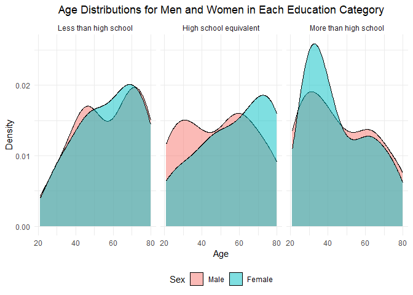
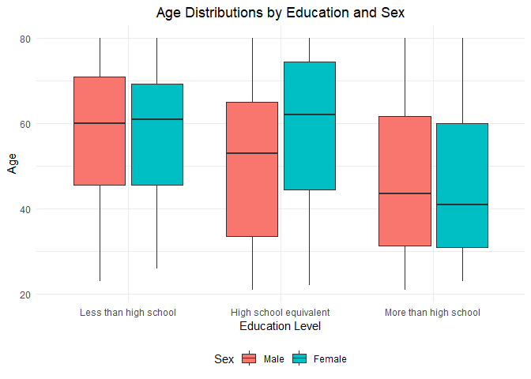
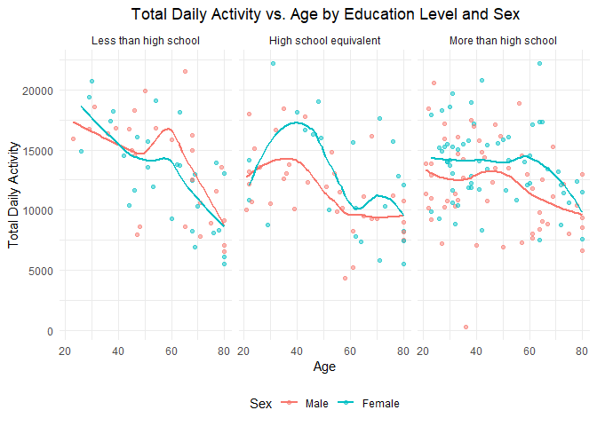
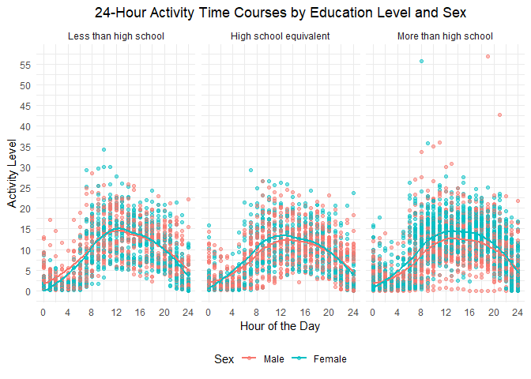

problem_2
================
sg4489
2024-10-12

``` r
library(tidyverse)
library(gt)
library(ggplot2)
```

# Problem 2

First, load the data using read.csv(), skipping the first four rows.

``` r
# Import the participants’ demographic data
nhanes_covar <- read_csv("datasets/nhanes_covar.csv", 
                         skip = 4, show_col_types = FALSE)

# Import their accelerometer data
nhanes_accel <- read_csv("datasets/nhanes_accel.csv", show_col_types = FALSE)

#Show the demographic data
glimpse(nhanes_covar)
```

    ## Rows: 250
    ## Columns: 5
    ## $ SEQN      <dbl> 62161, 62164, 62169, 62174, 62177, 62178, 62180, 62184, 6218…
    ## $ sex       <dbl> 1, 2, 1, 1, 1, 1, 1, 1, 2, 2, 1, 1, 2, 1, 1, 1, 2, 1, 2, 2, …
    ## $ age       <dbl> 22, 44, 21, 80, 51, 80, 35, 26, 17, 30, 70, 17, 16, 57, 36, …
    ## $ BMI       <dbl> 23.3, 23.2, 20.1, 33.9, 20.1, 28.5, 27.9, 22.1, 22.9, 22.4, …
    ## $ education <dbl> 2, 3, 2, 3, 2, 2, 3, 2, NA, 3, 2, NA, NA, 3, 1, 3, 3, 3, 1, …

``` r
# Use select() to select the first six columns and use glimpse() to display accelerometer data
nhanes_accel %>% select(1:6) %>% glimpse()
```

    ## Rows: 250
    ## Columns: 6
    ## $ SEQN <dbl> 62161, 62164, 62169, 62174, 62177, 62178, 62180, 62184, 62186, 62…
    ## $ min1 <dbl> 1.1060000, 1.9245714, 5.8468571, 5.4210000, 6.1432857, 0.1665714,…
    ## $ min2 <dbl> 3.11516667, 1.66942857, 5.17771429, 3.48216667, 8.05742857, 0.428…
    ## $ min3 <dbl> 1.46750000, 2.37600000, 4.76285714, 3.71733333, 9.99028571, 0.131…
    ## $ min4 <dbl> 0.9376667, 0.9345714, 6.4820000, 3.8083333, 6.5981429, 1.2022857,…
    ## $ min5 <dbl> 1.59866667, 2.59314286, 6.85357143, 6.85466667, 4.57100000, 0.079…

### Load, tidy, merge, and otherwise organize the data sets.

Below is how to exclude participants less than 21 years of age, and
those with missing demographic data; and encode data with reasonable
variable classes (i.e. not numeric, and using factors with the ordering
of tables and plots in mind).

``` r
# Filter participants who are 21 or older
nhanes_covar <- nhanes_covar %>% filter(age >= 21)

# Remove rows with missing data
nhanes_covar <- nhanes_covar %>% drop_na()

# Convert 'sex' and 'education' columns to factors with appropriate labels
nhanes_covar <- nhanes_covar %>% 
  mutate(
    sex = factor(sex, levels = c(1, 2), labels = c("Male", "Female")), 
    education = factor(education, levels= c(1, 2, 3), 
                        labels = c("Less than high school", "High school equivalent", "More than high school"))
  )

# Save the cleaned data
write_csv(nhanes_covar, "datasets/nhanes_covar_cleaned.csv")
```

### Visualization of gender-education, age-gender-education

Produce a reader-friendly table for the number of men and women in each
education category, and create a visualization of the age distributions
for men and women in each education category.

#### First, I create a table for the number of men and women in each education category:

``` r
# Generate a table of people classified by gender and education level
gender_education_table <- nhanes_covar %>% 
  group_by(sex, education) %>% 
  summarise(count = n(), .groups = "drop") 

# Use pivot_wider to transform the data into a wide table format, with men on the left and women on the right
gender_education_wide <- gender_education_table %>%
  pivot_wider(names_from = sex, values_from = count, 
              names_prefix = "Count_") %>%
  rename(Male = Count_Male, Female = Count_Female)

# Using gt() to create a more readable table
gender_education_wide %>%
  gt() %>%
  tab_header(title = "Number of Men and Women in Each Education Category")
```

<div id="vgswjjpqmi" style="padding-left:0px;padding-right:0px;padding-top:10px;padding-bottom:10px;overflow-x:auto;overflow-y:auto;width:auto;height:auto;">
<style>#vgswjjpqmi table {
  font-family: system-ui, 'Segoe UI', Roboto, Helvetica, Arial, sans-serif, 'Apple Color Emoji', 'Segoe UI Emoji', 'Segoe UI Symbol', 'Noto Color Emoji';
  -webkit-font-smoothing: antialiased;
  -moz-osx-font-smoothing: grayscale;
}
&#10;#vgswjjpqmi thead, #vgswjjpqmi tbody, #vgswjjpqmi tfoot, #vgswjjpqmi tr, #vgswjjpqmi td, #vgswjjpqmi th {
  border-style: none;
}
&#10;#vgswjjpqmi p {
  margin: 0;
  padding: 0;
}
&#10;#vgswjjpqmi .gt_table {
  display: table;
  border-collapse: collapse;
  line-height: normal;
  margin-left: auto;
  margin-right: auto;
  color: #333333;
  font-size: 16px;
  font-weight: normal;
  font-style: normal;
  background-color: #FFFFFF;
  width: auto;
  border-top-style: solid;
  border-top-width: 2px;
  border-top-color: #A8A8A8;
  border-right-style: none;
  border-right-width: 2px;
  border-right-color: #D3D3D3;
  border-bottom-style: solid;
  border-bottom-width: 2px;
  border-bottom-color: #A8A8A8;
  border-left-style: none;
  border-left-width: 2px;
  border-left-color: #D3D3D3;
}
&#10;#vgswjjpqmi .gt_caption {
  padding-top: 4px;
  padding-bottom: 4px;
}
&#10;#vgswjjpqmi .gt_title {
  color: #333333;
  font-size: 125%;
  font-weight: initial;
  padding-top: 4px;
  padding-bottom: 4px;
  padding-left: 5px;
  padding-right: 5px;
  border-bottom-color: #FFFFFF;
  border-bottom-width: 0;
}
&#10;#vgswjjpqmi .gt_subtitle {
  color: #333333;
  font-size: 85%;
  font-weight: initial;
  padding-top: 3px;
  padding-bottom: 5px;
  padding-left: 5px;
  padding-right: 5px;
  border-top-color: #FFFFFF;
  border-top-width: 0;
}
&#10;#vgswjjpqmi .gt_heading {
  background-color: #FFFFFF;
  text-align: center;
  border-bottom-color: #FFFFFF;
  border-left-style: none;
  border-left-width: 1px;
  border-left-color: #D3D3D3;
  border-right-style: none;
  border-right-width: 1px;
  border-right-color: #D3D3D3;
}
&#10;#vgswjjpqmi .gt_bottom_border {
  border-bottom-style: solid;
  border-bottom-width: 2px;
  border-bottom-color: #D3D3D3;
}
&#10;#vgswjjpqmi .gt_col_headings {
  border-top-style: solid;
  border-top-width: 2px;
  border-top-color: #D3D3D3;
  border-bottom-style: solid;
  border-bottom-width: 2px;
  border-bottom-color: #D3D3D3;
  border-left-style: none;
  border-left-width: 1px;
  border-left-color: #D3D3D3;
  border-right-style: none;
  border-right-width: 1px;
  border-right-color: #D3D3D3;
}
&#10;#vgswjjpqmi .gt_col_heading {
  color: #333333;
  background-color: #FFFFFF;
  font-size: 100%;
  font-weight: normal;
  text-transform: inherit;
  border-left-style: none;
  border-left-width: 1px;
  border-left-color: #D3D3D3;
  border-right-style: none;
  border-right-width: 1px;
  border-right-color: #D3D3D3;
  vertical-align: bottom;
  padding-top: 5px;
  padding-bottom: 6px;
  padding-left: 5px;
  padding-right: 5px;
  overflow-x: hidden;
}
&#10;#vgswjjpqmi .gt_column_spanner_outer {
  color: #333333;
  background-color: #FFFFFF;
  font-size: 100%;
  font-weight: normal;
  text-transform: inherit;
  padding-top: 0;
  padding-bottom: 0;
  padding-left: 4px;
  padding-right: 4px;
}
&#10;#vgswjjpqmi .gt_column_spanner_outer:first-child {
  padding-left: 0;
}
&#10;#vgswjjpqmi .gt_column_spanner_outer:last-child {
  padding-right: 0;
}
&#10;#vgswjjpqmi .gt_column_spanner {
  border-bottom-style: solid;
  border-bottom-width: 2px;
  border-bottom-color: #D3D3D3;
  vertical-align: bottom;
  padding-top: 5px;
  padding-bottom: 5px;
  overflow-x: hidden;
  display: inline-block;
  width: 100%;
}
&#10;#vgswjjpqmi .gt_spanner_row {
  border-bottom-style: hidden;
}
&#10;#vgswjjpqmi .gt_group_heading {
  padding-top: 8px;
  padding-bottom: 8px;
  padding-left: 5px;
  padding-right: 5px;
  color: #333333;
  background-color: #FFFFFF;
  font-size: 100%;
  font-weight: initial;
  text-transform: inherit;
  border-top-style: solid;
  border-top-width: 2px;
  border-top-color: #D3D3D3;
  border-bottom-style: solid;
  border-bottom-width: 2px;
  border-bottom-color: #D3D3D3;
  border-left-style: none;
  border-left-width: 1px;
  border-left-color: #D3D3D3;
  border-right-style: none;
  border-right-width: 1px;
  border-right-color: #D3D3D3;
  vertical-align: middle;
  text-align: left;
}
&#10;#vgswjjpqmi .gt_empty_group_heading {
  padding: 0.5px;
  color: #333333;
  background-color: #FFFFFF;
  font-size: 100%;
  font-weight: initial;
  border-top-style: solid;
  border-top-width: 2px;
  border-top-color: #D3D3D3;
  border-bottom-style: solid;
  border-bottom-width: 2px;
  border-bottom-color: #D3D3D3;
  vertical-align: middle;
}
&#10;#vgswjjpqmi .gt_from_md > :first-child {
  margin-top: 0;
}
&#10;#vgswjjpqmi .gt_from_md > :last-child {
  margin-bottom: 0;
}
&#10;#vgswjjpqmi .gt_row {
  padding-top: 8px;
  padding-bottom: 8px;
  padding-left: 5px;
  padding-right: 5px;
  margin: 10px;
  border-top-style: solid;
  border-top-width: 1px;
  border-top-color: #D3D3D3;
  border-left-style: none;
  border-left-width: 1px;
  border-left-color: #D3D3D3;
  border-right-style: none;
  border-right-width: 1px;
  border-right-color: #D3D3D3;
  vertical-align: middle;
  overflow-x: hidden;
}
&#10;#vgswjjpqmi .gt_stub {
  color: #333333;
  background-color: #FFFFFF;
  font-size: 100%;
  font-weight: initial;
  text-transform: inherit;
  border-right-style: solid;
  border-right-width: 2px;
  border-right-color: #D3D3D3;
  padding-left: 5px;
  padding-right: 5px;
}
&#10;#vgswjjpqmi .gt_stub_row_group {
  color: #333333;
  background-color: #FFFFFF;
  font-size: 100%;
  font-weight: initial;
  text-transform: inherit;
  border-right-style: solid;
  border-right-width: 2px;
  border-right-color: #D3D3D3;
  padding-left: 5px;
  padding-right: 5px;
  vertical-align: top;
}
&#10;#vgswjjpqmi .gt_row_group_first td {
  border-top-width: 2px;
}
&#10;#vgswjjpqmi .gt_row_group_first th {
  border-top-width: 2px;
}
&#10;#vgswjjpqmi .gt_summary_row {
  color: #333333;
  background-color: #FFFFFF;
  text-transform: inherit;
  padding-top: 8px;
  padding-bottom: 8px;
  padding-left: 5px;
  padding-right: 5px;
}
&#10;#vgswjjpqmi .gt_first_summary_row {
  border-top-style: solid;
  border-top-color: #D3D3D3;
}
&#10;#vgswjjpqmi .gt_first_summary_row.thick {
  border-top-width: 2px;
}
&#10;#vgswjjpqmi .gt_last_summary_row {
  padding-top: 8px;
  padding-bottom: 8px;
  padding-left: 5px;
  padding-right: 5px;
  border-bottom-style: solid;
  border-bottom-width: 2px;
  border-bottom-color: #D3D3D3;
}
&#10;#vgswjjpqmi .gt_grand_summary_row {
  color: #333333;
  background-color: #FFFFFF;
  text-transform: inherit;
  padding-top: 8px;
  padding-bottom: 8px;
  padding-left: 5px;
  padding-right: 5px;
}
&#10;#vgswjjpqmi .gt_first_grand_summary_row {
  padding-top: 8px;
  padding-bottom: 8px;
  padding-left: 5px;
  padding-right: 5px;
  border-top-style: double;
  border-top-width: 6px;
  border-top-color: #D3D3D3;
}
&#10;#vgswjjpqmi .gt_last_grand_summary_row_top {
  padding-top: 8px;
  padding-bottom: 8px;
  padding-left: 5px;
  padding-right: 5px;
  border-bottom-style: double;
  border-bottom-width: 6px;
  border-bottom-color: #D3D3D3;
}
&#10;#vgswjjpqmi .gt_striped {
  background-color: rgba(128, 128, 128, 0.05);
}
&#10;#vgswjjpqmi .gt_table_body {
  border-top-style: solid;
  border-top-width: 2px;
  border-top-color: #D3D3D3;
  border-bottom-style: solid;
  border-bottom-width: 2px;
  border-bottom-color: #D3D3D3;
}
&#10;#vgswjjpqmi .gt_footnotes {
  color: #333333;
  background-color: #FFFFFF;
  border-bottom-style: none;
  border-bottom-width: 2px;
  border-bottom-color: #D3D3D3;
  border-left-style: none;
  border-left-width: 2px;
  border-left-color: #D3D3D3;
  border-right-style: none;
  border-right-width: 2px;
  border-right-color: #D3D3D3;
}
&#10;#vgswjjpqmi .gt_footnote {
  margin: 0px;
  font-size: 90%;
  padding-top: 4px;
  padding-bottom: 4px;
  padding-left: 5px;
  padding-right: 5px;
}
&#10;#vgswjjpqmi .gt_sourcenotes {
  color: #333333;
  background-color: #FFFFFF;
  border-bottom-style: none;
  border-bottom-width: 2px;
  border-bottom-color: #D3D3D3;
  border-left-style: none;
  border-left-width: 2px;
  border-left-color: #D3D3D3;
  border-right-style: none;
  border-right-width: 2px;
  border-right-color: #D3D3D3;
}
&#10;#vgswjjpqmi .gt_sourcenote {
  font-size: 90%;
  padding-top: 4px;
  padding-bottom: 4px;
  padding-left: 5px;
  padding-right: 5px;
}
&#10;#vgswjjpqmi .gt_left {
  text-align: left;
}
&#10;#vgswjjpqmi .gt_center {
  text-align: center;
}
&#10;#vgswjjpqmi .gt_right {
  text-align: right;
  font-variant-numeric: tabular-nums;
}
&#10;#vgswjjpqmi .gt_font_normal {
  font-weight: normal;
}
&#10;#vgswjjpqmi .gt_font_bold {
  font-weight: bold;
}
&#10;#vgswjjpqmi .gt_font_italic {
  font-style: italic;
}
&#10;#vgswjjpqmi .gt_super {
  font-size: 65%;
}
&#10;#vgswjjpqmi .gt_footnote_marks {
  font-size: 75%;
  vertical-align: 0.4em;
  position: initial;
}
&#10;#vgswjjpqmi .gt_asterisk {
  font-size: 100%;
  vertical-align: 0;
}
&#10;#vgswjjpqmi .gt_indent_1 {
  text-indent: 5px;
}
&#10;#vgswjjpqmi .gt_indent_2 {
  text-indent: 10px;
}
&#10;#vgswjjpqmi .gt_indent_3 {
  text-indent: 15px;
}
&#10;#vgswjjpqmi .gt_indent_4 {
  text-indent: 20px;
}
&#10;#vgswjjpqmi .gt_indent_5 {
  text-indent: 25px;
}
&#10;#vgswjjpqmi .katex-display {
  display: inline-flex !important;
  margin-bottom: 0.75em !important;
}
&#10;#vgswjjpqmi div.Reactable > div.rt-table > div.rt-thead > div.rt-tr.rt-tr-group-header > div.rt-th-group:after {
  height: 0px !important;
}
</style>
<table class="gt_table" data-quarto-disable-processing="false" data-quarto-bootstrap="false">
  <thead>
    <tr class="gt_heading">
      <td colspan="3" class="gt_heading gt_title gt_font_normal gt_bottom_border" style>Number of Men and Women in Each Education Category</td>
    </tr>
    &#10;    <tr class="gt_col_headings">
      <th class="gt_col_heading gt_columns_bottom_border gt_center" rowspan="1" colspan="1" scope="col" id="education">education</th>
      <th class="gt_col_heading gt_columns_bottom_border gt_right" rowspan="1" colspan="1" scope="col" id="Male">Male</th>
      <th class="gt_col_heading gt_columns_bottom_border gt_right" rowspan="1" colspan="1" scope="col" id="Female">Female</th>
    </tr>
  </thead>
  <tbody class="gt_table_body">
    <tr><td headers="education" class="gt_row gt_center">Less than high school</td>
<td headers="Male" class="gt_row gt_right">27</td>
<td headers="Female" class="gt_row gt_right">28</td></tr>
    <tr><td headers="education" class="gt_row gt_center">High school equivalent</td>
<td headers="Male" class="gt_row gt_right">35</td>
<td headers="Female" class="gt_row gt_right">23</td></tr>
    <tr><td headers="education" class="gt_row gt_center">More than high school</td>
<td headers="Male" class="gt_row gt_right">56</td>
<td headers="Female" class="gt_row gt_right">59</td></tr>
  </tbody>
  &#10;  
</table>
</div>

In this table:  
Less than high school: 27 men, 28 women—balanced ratio.  
High school equivalent: 35 men, 23 women—men outnumber women.  
More than high school: 56 men, 59 women—roughly equal numbers.  
To summary, Men dominate in the high school equivalent category, while
other education levels have a near-equal gender ratio.

#### Then, create a density plot of the age distributions for men and women in each education category.

``` r
# Use ggplot2 to create a density plot
ggplot(nhanes_covar, aes(x = age, fill = sex)) + 
  geom_density(alpha = 0.5) +  # Translucent effect, easy to see the overlapping parts
  facet_wrap(~education) +  # Split by education level
  labs(
    title = "Age Distributions for Men and Women in Each Education Category", 
    x = "Age", 
    y = "Density", 
    fill = "Sex"
  ) + 
  theme_minimal() +  # Remove some background elements to make the chart look cleaner
  theme(legend.position = "bottom",  # Place the legend at the bottom of the chart
        plot.title = element_text(hjust = 0.5))  # Set the title to center
```

<!-- -->

This density map shows the distribution of age by education level and
gender:  
Less than high school: Men concentrated between 40–60 years, women
mostly above 60. High school equivalent: Women mostly between 40–60
years, men have a broader age range. Women are mainly concentrated
between ages 40 and 60, showing a narrower range compared to men.  
More than high school: Men has the distribution peaks around ages 40 to
70, with a gradual taper toward 80, and women is similar to men, with a
slight peak between 50 and 60. Comment:  
In lower education categories, women tend to be older than men,
especially in the “less than high school” group.  
In the “high school equivalent” group, men have a much wider age range
than women.  
In the “more than high school” group, men and women show nearly
identical age distributions, indicating less gender disparity in age for
those with higher education levels.

#### And create a box plot.

``` r
# Create a box plot of age by gender and education
ggplot(nhanes_covar, aes(x = education, y = age, fill = sex)) +
  geom_boxplot() + 
  labs(
    title = "Age Distributions by Education and Sex",
    x = "Education Level",
    y = "Age",
    fill = "Sex"
  ) +
  theme_minimal() +  # Use a simple theme
  theme(legend.position = "bottom",  # Place the legend at the bottom of the chart
        plot.title = element_text(hjust = 0.5))  # Set the title to center
```

<!-- -->

This boxplot shows the age distributions for men and women across
different education levels: Less than high school, High school
equivalent, and More than high school. Each boxplot displays the median
age, interquartile range (IQR), and potential outliers for both genders.

### Using your tidied dataset, aggregate across minutes to create a total activity variable for each participant.

First, merge two datasets by SEQN.

``` r
# Use the left_join() function to merge the columns using the SEQN  column as the common column.
nhanes_merged <- left_join(nhanes_covar, nhanes_accel, by = "SEQN")
```

By using merged data, I can calculate the total activity for each
participant.

``` r
# Use pull() to extract all columns related to minute data and calculate the total activity for each participant
nhanes_merged <- nhanes_merged %>% 
  mutate(total_activity = rowSums(select(., starts_with("min")) %>%
                                    as.matrix(), na.rm = TRUE)) %>% 
  relocate(total_activity, .before = min1)  # Move total_activity before min1

#Show nhanes_merged
nhanes_merged %>% select(1:6) %>% glimpse()
```

    ## Rows: 228
    ## Columns: 6
    ## $ SEQN           <dbl> 62161, 62164, 62169, 62174, 62177, 62178, 62180, 62184,…
    ## $ sex            <fct> Male, Female, Male, Male, Male, Male, Male, Male, Femal…
    ## $ age            <dbl> 22, 44, 21, 80, 51, 80, 35, 26, 30, 57, 36, 28, 35, 38,…
    ## $ BMI            <dbl> 23.3, 23.2, 20.1, 33.9, 20.1, 28.5, 27.9, 22.1, 22.4, 2…
    ## $ education      <fct> High school equivalent, More than high school, High sch…
    ## $ total_activity <dbl> 13194.086, 13411.411, 9991.222, 8579.092, 11917.970, 74…

Now, column total_activity in nhanes_merged represent total activity in
all minutes for each participant.  
Therefore, I can Use ggplot2 to plot total activity versus age, and
facet by gender and education level.

``` r
# Plot the relationship between total activity and age
ggplot(nhanes_merged, aes(x = age, y = total_activity, colour = sex)) + 
  geom_point(alpha = 0.5) +  # Draw a scatter plot
  geom_smooth(method = "loess", se = FALSE) +  # Add a smooth trend line
  facet_wrap(~ education) +  # Faced by education level
  labs(
    title = "Total Daily Activity vs. Age by Education Level and Sex",
    x = "Age",
    y = "Total Daily Activity",
    color = "Sex"
  ) + 
  theme_minimal() +  # Simple theme
  theme(
    legend.position = "bottom", 
    plot.title = element_text(hjust = 0.5)
  )
```

    ## `geom_smooth()` using formula = 'y ~ x'

<!-- -->

This plot compares total daily activity (y-axis) against age (x-axis),
separated by education level (facets) and showing differences between
men (red) and women (blue).

1.  Less than high school:  
    Both men and women show a clear decrease in total daily activity as
    they age.  
    Activity levels for men are slightly higher than women at younger
    ages, but both decrease significantly with age, particularly after
    60.  
    Women show a steeper decline in activity after age 50, with almost
    no activity beyond age 70.  
    This group shows a strong age-related decline in activity, with both
    genders being less active at older ages, though women seem to
    experience a sharper decline.

2.  High school equivalent:  
    Women have a noticeable peak in activity around age 40–50, but their
    activity decreases steadily afterward.  
    Men show a flatter, more gradual decline with age, with lower
    activity than women at middle age but converging in older ages
    (60+).  
    Women in this group tend to be more active during middle age
    (40–50), but their activity decreases more rapidly compared to men,
    who show a more consistent decline.

3.  More than high school:  
    Men and women in this group show relatively similar activity levels
    at younger and middle ages, with a slight decrease as they get
    older.  
    Both genders maintain higher activity levels compared to the other
    education groups until their 50s, after which their activity begins
    to decline.  
    People with more than high school education tend to maintain higher
    activity levels through middle age, with smaller gender differences.
    Their overall activity declines more gradually compared to the less
    educated groups.

Overall Observations:  
Age-related decline: Across all education levels, both men and women
show a decrease in physical activity as they age, particularly after
50.  
Education level differences: Those with higher education levels tend to
maintain higher activity levels into middle age compared to those with
lower education.  
Gender differences: In the “high school equivalent” group, women are
more active during middle age, while in the “less than high school”
group, men maintain slightly higher activity levels until old age.

### A three-panel plot that shows the 24-hour activity time courses for each education level.

#### Data reshaping

First I need to reshape the data to have a time course that represents
the hours of the day.

``` r
# Convert minute columns into long format to represent time in minutes
activity_long <- nhanes_merged %>% 
  pivot_longer(cols = starts_with("min"),  #The pivot_longer() function converts data from wide format to long format.
               names_to = "minute", 
               values_to = "activity") %>% 
  mutate(minute = as.numeric(gsub("min", "", minute))) %>% 
  mutate(hour = floor(minute / 60)) %>% 
  group_by(SEQN, sex, age, education, hour) %>% 
  summarise(mean_activity = mean(activity, na.rm = TRUE), .groups = "drop") 
```

Now I have converted the minutes of data into hourly data and combine it
with gender and education level.

#### Create the Plot

Let me create a plot where we have 24-hour activity time courses
separated by education level (facets), and we use color to differentiate
between men and women. We’ll also include a smooth trend to highlight
patterns in activity levels over the day.

``` r
ggplot(activity_long, aes(x = hour, y = mean_activity, color = sex)) + 
  geom_point(alpha = 0.5, size = 1.5) +  # Add points to represent minute-level activity
  geom_smooth(method = "loess", se = FALSE) +  # Add a smooth trend line
  facet_wrap(~ education) +  # Create three panels by education level 
  labs(
    title = "24-Hour Activity Time Courses by Education Level and Sex", 
    x = "Hour of the Day", 
    y = "Activity Level", 
    color = "Sex"
  ) + 
  scale_x_continuous(breaks = seq(0, 24, by = 4)) +  # Display a tick every 4 hours
  scale_y_continuous(breaks = seq(0, 60, by = 5)) + 
  theme_minimal() +  # Minimalist theme
  theme(
    plot.title = element_text(hjust = 0.5),  # Center the title
    legend.position = "bottom"  # Place legend at the bottom
  )
```

    ## `geom_smooth()` using formula = 'y ~ x'

<!-- -->

This plot shows 24-hour activity levels by education level and sex. The
x-axis represents the hour of the day, and the y-axis shows activity
levels. Each panel represents a different education level, with red for
males and blue for females.  
Higher education correlates with more structured daily activity
patterns, while males tend to be slightly more active than females,
particularly during peak activity times.

1.  Daily Activity Pattern:  
    Across all groups, activity rises in the morning, peaks between 10
    AM and 3 PM, and declines in the evening, with minimal activity at
    night.  
2.  Education Level Differences:  
    Less than high school: More variability and lower, less structured
    activity levels.  
    High school equivalent: A clearer, more sustained midday peak.  
    More than high school: Most consistent pattern with a sharp rise in
    the morning, a midday peak, and a steady evening decline.  
3.  Sex Differences:  
    Males generally show slightly higher activity levels, especially
    during peak hours, though trends for males and females are quite
    similar across all education levels.
