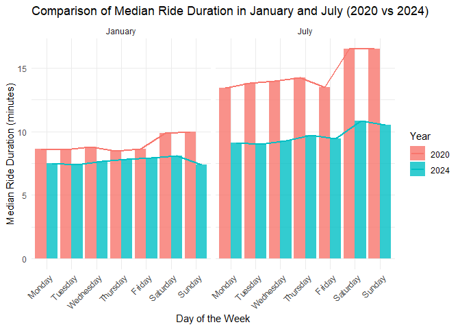
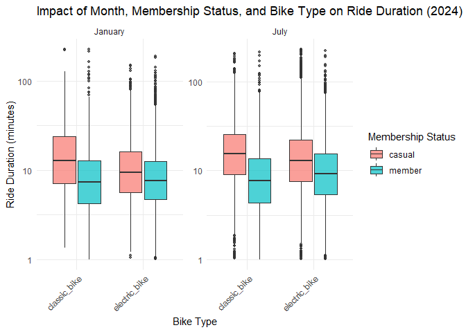

problem_3
================
sg4489
2024-10-12

``` r
library(tidyverse)
library(gt)
library(ggplot2)
```

# Problem 3

### Import, clean, and tidy these data, and describe the resulting dataset.

#### Import datasets

There are 4 dataset I need to import: Jan_2020_Citi, Jan_2024_Citi,
July_2020_Citi, and July_2024_Citi.

``` r
Jan_2020_Citi <- read_csv("datasets/citibike/Jan 2020 Citi.csv/Jan 2020 Citi.csv", show_col_types = FALSE)
Jan_2024_Citi <- read_csv("datasets/citibike/Jan 2024 Citi.csv/Jan 2024 Citi.csv", show_col_types = FALSE)
July_2020_Citi <- read_csv("datasets/citibike/July 2020 Citi.csv/July 2020 Citi.csv", show_col_types = FALSE)
July_2024_Citi <- read_csv("datasets/citibike/July 2024 Citi.csv/July 2024 Citi.csv", show_col_types = FALSE) 
```

#### Clean and tidy the data

``` r
# Add year, month and dataset source columns to each dataset 
Jan_2020_Citi <- Jan_2020_Citi %>% 
  mutate(year = 2020, month = "January", dataset = "Jan_2020_Citi")
Jan_2024_Citi <- Jan_2024_Citi %>% 
  mutate(year = 2024, month = "January", dataset = "Jan_2024_Citi")
July_2020_Citi <- July_2020_Citi %>% 
  mutate(year = 2020, month = "July", dataset = "July_2020_Citi")
July_2024_Citi <- July_2024_Citi %>% 
  mutate(year = 2024, month = "July", dataset = "July_2024_Citi")

# Merge all datasets 
citi_data <- bind_rows(Jan_2020_Citi, Jan_2024_Citi, July_2020_Citi, July_2024_Citi) 

# Check
glimpse(citi_data)
```

    ## Rows: 99,485
    ## Columns: 10
    ## $ ride_id            <chr> "4BE06CB33B037044", "26886E034974493B", "24DC56060E…
    ## $ rideable_type      <chr> "classic_bike", "classic_bike", "classic_bike", "cl…
    ## $ weekdays           <chr> "Tuesday", "Wednesday", "Friday", "Sunday", "Friday…
    ## $ duration           <dbl> 15.333267, 5.309467, 9.691800, 6.996183, 2.849500, …
    ## $ start_station_name <chr> "Columbus Ave & W 95 St", "2 Ave & E 96 St", "Colum…
    ## $ end_station_name   <chr> "E 53 St & Madison Ave", "1 Ave & E 110 St", "Grand…
    ## $ member_casual      <chr> "member", "member", "member", "member", "member", "…
    ## $ year               <dbl> 2020, 2020, 2020, 2020, 2020, 2020, 2020, 2020, 202…
    ## $ month              <chr> "January", "January", "January", "January", "Januar…
    ## $ dataset            <chr> "Jan_2020_Citi", "Jan_2020_Citi", "Jan_2020_Citi", …

I have combined these datasets into one large data frame. Now I need to
check if there are any missing values in the data and handle them as
needed.

``` r
# Check missing data
colSums(is.na(citi_data))
```

    ##            ride_id      rideable_type           weekdays           duration 
    ##                  0                  0                  0                  0 
    ## start_station_name   end_station_name      member_casual               year 
    ##                 43                207                  0                  0 
    ##              month            dataset 
    ##                  0                  0

The dataset is generally complete, except for some missing station
names. The missing values in station names could occur due to technical
issues (e.g., GPS errors) or data entry problems.  
To handle the missing station name, I mark label the missing station
name as “Unknown”.

``` r
# Lable missing station name as Unknown
citi_data <- citi_data %>%
  mutate(
    start_station_name = ifelse(is.na(start_station_name), "Unknown", start_station_name),
    end_station_name = ifelse(is.na(end_station_name), "Unknown", end_station_name)
  )
```

Next, I will check whether there is duplicate and abnormal data.

``` r
# Remove duplicate rows
citi_data <- citi_data %>%
  distinct()

# Check for abnormal riding duration and delete data with negative or unreasonable duration
citi_data <- citi_data %>%
  filter(duration >= 0) 
```

Finally, rearrange the column names to make the data more readable.

``` r
citi_data <- citi_data %>%
  select(
    ride_id, member_casual, rideable_type, year, month, weekdays, duration, start_station_name, end_station_name, dataset)
```

#### Describe the resulting dataset.

This dataset provides information on Citi Bike rides taken in January
and July of 2020 and 2024. Key columns include:  
ride_id: Unique identifier for each ride.  
member_casual: Rider type, either member or casual.  
rideable_type: Type of bike, either classic_bike or electric_bike.  
year and month: Year and month of the ride.  
weekdays: Day of the week when the ride occurred.  
duration: Ride duration in minutes.  
start_station_name and end_station_name: Starting and ending stations.  
dataset: Indicates the dataset source (e.g., Jan_2020_Citi).

This dataset is ready for analysis on ridership trends, user behavior,
and ride patterns across different time periods and rider types.

### Showing the total number of rides in each combination of year and month separating casual riders and Citi Bike members.

#### Create a table.

To create an easy-to-read table showing the total number of rides for
each year and month combination, separating casual riders and Citi Bike
members, we can aggregate the data by grouping by year, month, and
member_casual, then calculate the total number of rides. Afterwards, we
can use the gt() package to format the results into an easy-to-read
format.

``` r
# Summarize total rides by year, month, and rider type
summary_table <- citi_data %>% 
  group_by(year, month, member_casual) %>% 
  summarise(total_rides = n(), .groups = "drop")

# Pivot the table to have rider types as columns
pivoted_table <- summary_table %>% 
  pivot_wider(names_from = member_casual, values_from = total_rides, names_prefix = "Total_") %>% 
  mutate(Total_Rides = Total_member + Total_casual)  # Calculate sum of member and casual rides

# Create a reader-friendly table using gt()
pivoted_table %>% 
  gt() %>% 
  tab_header(title = "Total Number of Rides by Year, Month, and Rider Type", 
             subtitle = "Citi Bike Member vs Casual Riders") %>% 
  cols_label(
    year = "Year", 
    month = "Month", 
    Total_member = "Member Total Rides", 
    Total_casual = "Casual Total Rides",
    Total_Rides = "Total Rides"
  ) %>% 
   fmt_number(columns = c(Total_member, Total_casual, Total_Rides))
```

<div id="pneujdgzle" style="padding-left:0px;padding-right:0px;padding-top:10px;padding-bottom:10px;overflow-x:auto;overflow-y:auto;width:auto;height:auto;">
<style>#pneujdgzle table {
  font-family: system-ui, 'Segoe UI', Roboto, Helvetica, Arial, sans-serif, 'Apple Color Emoji', 'Segoe UI Emoji', 'Segoe UI Symbol', 'Noto Color Emoji';
  -webkit-font-smoothing: antialiased;
  -moz-osx-font-smoothing: grayscale;
}
&#10;#pneujdgzle thead, #pneujdgzle tbody, #pneujdgzle tfoot, #pneujdgzle tr, #pneujdgzle td, #pneujdgzle th {
  border-style: none;
}
&#10;#pneujdgzle p {
  margin: 0;
  padding: 0;
}
&#10;#pneujdgzle .gt_table {
  display: table;
  border-collapse: collapse;
  line-height: normal;
  margin-left: auto;
  margin-right: auto;
  color: #333333;
  font-size: 16px;
  font-weight: normal;
  font-style: normal;
  background-color: #FFFFFF;
  width: auto;
  border-top-style: solid;
  border-top-width: 2px;
  border-top-color: #A8A8A8;
  border-right-style: none;
  border-right-width: 2px;
  border-right-color: #D3D3D3;
  border-bottom-style: solid;
  border-bottom-width: 2px;
  border-bottom-color: #A8A8A8;
  border-left-style: none;
  border-left-width: 2px;
  border-left-color: #D3D3D3;
}
&#10;#pneujdgzle .gt_caption {
  padding-top: 4px;
  padding-bottom: 4px;
}
&#10;#pneujdgzle .gt_title {
  color: #333333;
  font-size: 125%;
  font-weight: initial;
  padding-top: 4px;
  padding-bottom: 4px;
  padding-left: 5px;
  padding-right: 5px;
  border-bottom-color: #FFFFFF;
  border-bottom-width: 0;
}
&#10;#pneujdgzle .gt_subtitle {
  color: #333333;
  font-size: 85%;
  font-weight: initial;
  padding-top: 3px;
  padding-bottom: 5px;
  padding-left: 5px;
  padding-right: 5px;
  border-top-color: #FFFFFF;
  border-top-width: 0;
}
&#10;#pneujdgzle .gt_heading {
  background-color: #FFFFFF;
  text-align: center;
  border-bottom-color: #FFFFFF;
  border-left-style: none;
  border-left-width: 1px;
  border-left-color: #D3D3D3;
  border-right-style: none;
  border-right-width: 1px;
  border-right-color: #D3D3D3;
}
&#10;#pneujdgzle .gt_bottom_border {
  border-bottom-style: solid;
  border-bottom-width: 2px;
  border-bottom-color: #D3D3D3;
}
&#10;#pneujdgzle .gt_col_headings {
  border-top-style: solid;
  border-top-width: 2px;
  border-top-color: #D3D3D3;
  border-bottom-style: solid;
  border-bottom-width: 2px;
  border-bottom-color: #D3D3D3;
  border-left-style: none;
  border-left-width: 1px;
  border-left-color: #D3D3D3;
  border-right-style: none;
  border-right-width: 1px;
  border-right-color: #D3D3D3;
}
&#10;#pneujdgzle .gt_col_heading {
  color: #333333;
  background-color: #FFFFFF;
  font-size: 100%;
  font-weight: normal;
  text-transform: inherit;
  border-left-style: none;
  border-left-width: 1px;
  border-left-color: #D3D3D3;
  border-right-style: none;
  border-right-width: 1px;
  border-right-color: #D3D3D3;
  vertical-align: bottom;
  padding-top: 5px;
  padding-bottom: 6px;
  padding-left: 5px;
  padding-right: 5px;
  overflow-x: hidden;
}
&#10;#pneujdgzle .gt_column_spanner_outer {
  color: #333333;
  background-color: #FFFFFF;
  font-size: 100%;
  font-weight: normal;
  text-transform: inherit;
  padding-top: 0;
  padding-bottom: 0;
  padding-left: 4px;
  padding-right: 4px;
}
&#10;#pneujdgzle .gt_column_spanner_outer:first-child {
  padding-left: 0;
}
&#10;#pneujdgzle .gt_column_spanner_outer:last-child {
  padding-right: 0;
}
&#10;#pneujdgzle .gt_column_spanner {
  border-bottom-style: solid;
  border-bottom-width: 2px;
  border-bottom-color: #D3D3D3;
  vertical-align: bottom;
  padding-top: 5px;
  padding-bottom: 5px;
  overflow-x: hidden;
  display: inline-block;
  width: 100%;
}
&#10;#pneujdgzle .gt_spanner_row {
  border-bottom-style: hidden;
}
&#10;#pneujdgzle .gt_group_heading {
  padding-top: 8px;
  padding-bottom: 8px;
  padding-left: 5px;
  padding-right: 5px;
  color: #333333;
  background-color: #FFFFFF;
  font-size: 100%;
  font-weight: initial;
  text-transform: inherit;
  border-top-style: solid;
  border-top-width: 2px;
  border-top-color: #D3D3D3;
  border-bottom-style: solid;
  border-bottom-width: 2px;
  border-bottom-color: #D3D3D3;
  border-left-style: none;
  border-left-width: 1px;
  border-left-color: #D3D3D3;
  border-right-style: none;
  border-right-width: 1px;
  border-right-color: #D3D3D3;
  vertical-align: middle;
  text-align: left;
}
&#10;#pneujdgzle .gt_empty_group_heading {
  padding: 0.5px;
  color: #333333;
  background-color: #FFFFFF;
  font-size: 100%;
  font-weight: initial;
  border-top-style: solid;
  border-top-width: 2px;
  border-top-color: #D3D3D3;
  border-bottom-style: solid;
  border-bottom-width: 2px;
  border-bottom-color: #D3D3D3;
  vertical-align: middle;
}
&#10;#pneujdgzle .gt_from_md > :first-child {
  margin-top: 0;
}
&#10;#pneujdgzle .gt_from_md > :last-child {
  margin-bottom: 0;
}
&#10;#pneujdgzle .gt_row {
  padding-top: 8px;
  padding-bottom: 8px;
  padding-left: 5px;
  padding-right: 5px;
  margin: 10px;
  border-top-style: solid;
  border-top-width: 1px;
  border-top-color: #D3D3D3;
  border-left-style: none;
  border-left-width: 1px;
  border-left-color: #D3D3D3;
  border-right-style: none;
  border-right-width: 1px;
  border-right-color: #D3D3D3;
  vertical-align: middle;
  overflow-x: hidden;
}
&#10;#pneujdgzle .gt_stub {
  color: #333333;
  background-color: #FFFFFF;
  font-size: 100%;
  font-weight: initial;
  text-transform: inherit;
  border-right-style: solid;
  border-right-width: 2px;
  border-right-color: #D3D3D3;
  padding-left: 5px;
  padding-right: 5px;
}
&#10;#pneujdgzle .gt_stub_row_group {
  color: #333333;
  background-color: #FFFFFF;
  font-size: 100%;
  font-weight: initial;
  text-transform: inherit;
  border-right-style: solid;
  border-right-width: 2px;
  border-right-color: #D3D3D3;
  padding-left: 5px;
  padding-right: 5px;
  vertical-align: top;
}
&#10;#pneujdgzle .gt_row_group_first td {
  border-top-width: 2px;
}
&#10;#pneujdgzle .gt_row_group_first th {
  border-top-width: 2px;
}
&#10;#pneujdgzle .gt_summary_row {
  color: #333333;
  background-color: #FFFFFF;
  text-transform: inherit;
  padding-top: 8px;
  padding-bottom: 8px;
  padding-left: 5px;
  padding-right: 5px;
}
&#10;#pneujdgzle .gt_first_summary_row {
  border-top-style: solid;
  border-top-color: #D3D3D3;
}
&#10;#pneujdgzle .gt_first_summary_row.thick {
  border-top-width: 2px;
}
&#10;#pneujdgzle .gt_last_summary_row {
  padding-top: 8px;
  padding-bottom: 8px;
  padding-left: 5px;
  padding-right: 5px;
  border-bottom-style: solid;
  border-bottom-width: 2px;
  border-bottom-color: #D3D3D3;
}
&#10;#pneujdgzle .gt_grand_summary_row {
  color: #333333;
  background-color: #FFFFFF;
  text-transform: inherit;
  padding-top: 8px;
  padding-bottom: 8px;
  padding-left: 5px;
  padding-right: 5px;
}
&#10;#pneujdgzle .gt_first_grand_summary_row {
  padding-top: 8px;
  padding-bottom: 8px;
  padding-left: 5px;
  padding-right: 5px;
  border-top-style: double;
  border-top-width: 6px;
  border-top-color: #D3D3D3;
}
&#10;#pneujdgzle .gt_last_grand_summary_row_top {
  padding-top: 8px;
  padding-bottom: 8px;
  padding-left: 5px;
  padding-right: 5px;
  border-bottom-style: double;
  border-bottom-width: 6px;
  border-bottom-color: #D3D3D3;
}
&#10;#pneujdgzle .gt_striped {
  background-color: rgba(128, 128, 128, 0.05);
}
&#10;#pneujdgzle .gt_table_body {
  border-top-style: solid;
  border-top-width: 2px;
  border-top-color: #D3D3D3;
  border-bottom-style: solid;
  border-bottom-width: 2px;
  border-bottom-color: #D3D3D3;
}
&#10;#pneujdgzle .gt_footnotes {
  color: #333333;
  background-color: #FFFFFF;
  border-bottom-style: none;
  border-bottom-width: 2px;
  border-bottom-color: #D3D3D3;
  border-left-style: none;
  border-left-width: 2px;
  border-left-color: #D3D3D3;
  border-right-style: none;
  border-right-width: 2px;
  border-right-color: #D3D3D3;
}
&#10;#pneujdgzle .gt_footnote {
  margin: 0px;
  font-size: 90%;
  padding-top: 4px;
  padding-bottom: 4px;
  padding-left: 5px;
  padding-right: 5px;
}
&#10;#pneujdgzle .gt_sourcenotes {
  color: #333333;
  background-color: #FFFFFF;
  border-bottom-style: none;
  border-bottom-width: 2px;
  border-bottom-color: #D3D3D3;
  border-left-style: none;
  border-left-width: 2px;
  border-left-color: #D3D3D3;
  border-right-style: none;
  border-right-width: 2px;
  border-right-color: #D3D3D3;
}
&#10;#pneujdgzle .gt_sourcenote {
  font-size: 90%;
  padding-top: 4px;
  padding-bottom: 4px;
  padding-left: 5px;
  padding-right: 5px;
}
&#10;#pneujdgzle .gt_left {
  text-align: left;
}
&#10;#pneujdgzle .gt_center {
  text-align: center;
}
&#10;#pneujdgzle .gt_right {
  text-align: right;
  font-variant-numeric: tabular-nums;
}
&#10;#pneujdgzle .gt_font_normal {
  font-weight: normal;
}
&#10;#pneujdgzle .gt_font_bold {
  font-weight: bold;
}
&#10;#pneujdgzle .gt_font_italic {
  font-style: italic;
}
&#10;#pneujdgzle .gt_super {
  font-size: 65%;
}
&#10;#pneujdgzle .gt_footnote_marks {
  font-size: 75%;
  vertical-align: 0.4em;
  position: initial;
}
&#10;#pneujdgzle .gt_asterisk {
  font-size: 100%;
  vertical-align: 0;
}
&#10;#pneujdgzle .gt_indent_1 {
  text-indent: 5px;
}
&#10;#pneujdgzle .gt_indent_2 {
  text-indent: 10px;
}
&#10;#pneujdgzle .gt_indent_3 {
  text-indent: 15px;
}
&#10;#pneujdgzle .gt_indent_4 {
  text-indent: 20px;
}
&#10;#pneujdgzle .gt_indent_5 {
  text-indent: 25px;
}
&#10;#pneujdgzle .katex-display {
  display: inline-flex !important;
  margin-bottom: 0.75em !important;
}
&#10;#pneujdgzle div.Reactable > div.rt-table > div.rt-thead > div.rt-tr.rt-tr-group-header > div.rt-th-group:after {
  height: 0px !important;
}
</style>
<table class="gt_table" data-quarto-disable-processing="false" data-quarto-bootstrap="false">
  <thead>
    <tr class="gt_heading">
      <td colspan="5" class="gt_heading gt_title gt_font_normal" style>Total Number of Rides by Year, Month, and Rider Type</td>
    </tr>
    <tr class="gt_heading">
      <td colspan="5" class="gt_heading gt_subtitle gt_font_normal gt_bottom_border" style>Citi Bike Member vs Casual Riders</td>
    </tr>
    <tr class="gt_col_headings">
      <th class="gt_col_heading gt_columns_bottom_border gt_right" rowspan="1" colspan="1" scope="col" id="year">Year</th>
      <th class="gt_col_heading gt_columns_bottom_border gt_left" rowspan="1" colspan="1" scope="col" id="month">Month</th>
      <th class="gt_col_heading gt_columns_bottom_border gt_right" rowspan="1" colspan="1" scope="col" id="Total_casual">Casual Total Rides</th>
      <th class="gt_col_heading gt_columns_bottom_border gt_right" rowspan="1" colspan="1" scope="col" id="Total_member">Member Total Rides</th>
      <th class="gt_col_heading gt_columns_bottom_border gt_right" rowspan="1" colspan="1" scope="col" id="Total_Rides">Total Rides</th>
    </tr>
  </thead>
  <tbody class="gt_table_body">
    <tr><td headers="year" class="gt_row gt_right">2020</td>
<td headers="month" class="gt_row gt_left">January</td>
<td headers="Total_casual" class="gt_row gt_right">984.00</td>
<td headers="Total_member" class="gt_row gt_right">11,436.00</td>
<td headers="Total_Rides" class="gt_row gt_right">12,420.00</td></tr>
    <tr><td headers="year" class="gt_row gt_right">2020</td>
<td headers="month" class="gt_row gt_left">July</td>
<td headers="Total_casual" class="gt_row gt_right">5,637.00</td>
<td headers="Total_member" class="gt_row gt_right">15,411.00</td>
<td headers="Total_Rides" class="gt_row gt_right">21,048.00</td></tr>
    <tr><td headers="year" class="gt_row gt_right">2024</td>
<td headers="month" class="gt_row gt_left">January</td>
<td headers="Total_casual" class="gt_row gt_right">2,108.00</td>
<td headers="Total_member" class="gt_row gt_right">16,753.00</td>
<td headers="Total_Rides" class="gt_row gt_right">18,861.00</td></tr>
    <tr><td headers="year" class="gt_row gt_right">2024</td>
<td headers="month" class="gt_row gt_left">July</td>
<td headers="Total_casual" class="gt_row gt_right">10,894.00</td>
<td headers="Total_member" class="gt_row gt_right">36,262.00</td>
<td headers="Total_Rides" class="gt_row gt_right">47,156.00</td></tr>
  </tbody>
  &#10;  
</table>
</div>

#### Comment on these results.

The table now includes a Total Rides column, which makes it easy to see
the combined rides from both members and casual riders for each time
period. This format highlights the overall ridership trends while still
showing the breakdown between rider types.

1.  Casual vs. Member Rides:  
    Members consistently take significantly more rides than casual
    riders, which aligns with the expectation that members are regular
    users, while casual users are occasional riders or tourists.  
2.  Seasonality:  
    There is a noticeable increase in rides in July compared to January
    for both years, which suggests seasonal usage patterns. This likely
    reflects the fact that summer months see higher ridership due to
    favorable weather.  
3.  Year-over-Year Growth:  
    Comparing 2020 and 2024, we observe growth in the total number of
    rides in both January and July. This indicates an overall increase
    in Citi Bike usage over the four-year span.

### Make a table showing the 5 most popular starting stations for July 2024.

First I should find the 5 most popular starting stations.

``` r
# Filter the data for July 2024
july_2024_data <- citi_data %>% 
  filter(year == 2024, month == "July")

# Find the 5 most popular starting stations
popular_stations <- july_2024_data %>% 
  group_by(start_station_name) %>%  # Group the data by start_station_name
  summarise(total_rides = n()) %>%  # Count the number of rides originating from each station
  arrange(desc(total_rides)) %>%  # Sort stations in descending order of the total number of rides
  slice_head(n = 5)  # Selects the top 5 starting stations

# Show the 5 most popular stations
cat("The 5 most popular starting stations are", 
    paste(popular_stations %>% pull(start_station_name), collapse = ", "), "\n")
```

    ## The 5 most popular starting stations are Pier 61 at Chelsea Piers, University Pl & E 14 St, W 21 St & 6 Ave, West St & Chambers St, W 31 St & 7 Ave

Display them in a table:

``` r
popular_stations %>% 
  gt() %>% 
  tab_header(title = "Top 5 Starting Stations for July 2024",
             subtitle = "Based on Number of Rides")
```

<div id="urnoevdobg" style="padding-left:0px;padding-right:0px;padding-top:10px;padding-bottom:10px;overflow-x:auto;overflow-y:auto;width:auto;height:auto;">
<style>#urnoevdobg table {
  font-family: system-ui, 'Segoe UI', Roboto, Helvetica, Arial, sans-serif, 'Apple Color Emoji', 'Segoe UI Emoji', 'Segoe UI Symbol', 'Noto Color Emoji';
  -webkit-font-smoothing: antialiased;
  -moz-osx-font-smoothing: grayscale;
}
&#10;#urnoevdobg thead, #urnoevdobg tbody, #urnoevdobg tfoot, #urnoevdobg tr, #urnoevdobg td, #urnoevdobg th {
  border-style: none;
}
&#10;#urnoevdobg p {
  margin: 0;
  padding: 0;
}
&#10;#urnoevdobg .gt_table {
  display: table;
  border-collapse: collapse;
  line-height: normal;
  margin-left: auto;
  margin-right: auto;
  color: #333333;
  font-size: 16px;
  font-weight: normal;
  font-style: normal;
  background-color: #FFFFFF;
  width: auto;
  border-top-style: solid;
  border-top-width: 2px;
  border-top-color: #A8A8A8;
  border-right-style: none;
  border-right-width: 2px;
  border-right-color: #D3D3D3;
  border-bottom-style: solid;
  border-bottom-width: 2px;
  border-bottom-color: #A8A8A8;
  border-left-style: none;
  border-left-width: 2px;
  border-left-color: #D3D3D3;
}
&#10;#urnoevdobg .gt_caption {
  padding-top: 4px;
  padding-bottom: 4px;
}
&#10;#urnoevdobg .gt_title {
  color: #333333;
  font-size: 125%;
  font-weight: initial;
  padding-top: 4px;
  padding-bottom: 4px;
  padding-left: 5px;
  padding-right: 5px;
  border-bottom-color: #FFFFFF;
  border-bottom-width: 0;
}
&#10;#urnoevdobg .gt_subtitle {
  color: #333333;
  font-size: 85%;
  font-weight: initial;
  padding-top: 3px;
  padding-bottom: 5px;
  padding-left: 5px;
  padding-right: 5px;
  border-top-color: #FFFFFF;
  border-top-width: 0;
}
&#10;#urnoevdobg .gt_heading {
  background-color: #FFFFFF;
  text-align: center;
  border-bottom-color: #FFFFFF;
  border-left-style: none;
  border-left-width: 1px;
  border-left-color: #D3D3D3;
  border-right-style: none;
  border-right-width: 1px;
  border-right-color: #D3D3D3;
}
&#10;#urnoevdobg .gt_bottom_border {
  border-bottom-style: solid;
  border-bottom-width: 2px;
  border-bottom-color: #D3D3D3;
}
&#10;#urnoevdobg .gt_col_headings {
  border-top-style: solid;
  border-top-width: 2px;
  border-top-color: #D3D3D3;
  border-bottom-style: solid;
  border-bottom-width: 2px;
  border-bottom-color: #D3D3D3;
  border-left-style: none;
  border-left-width: 1px;
  border-left-color: #D3D3D3;
  border-right-style: none;
  border-right-width: 1px;
  border-right-color: #D3D3D3;
}
&#10;#urnoevdobg .gt_col_heading {
  color: #333333;
  background-color: #FFFFFF;
  font-size: 100%;
  font-weight: normal;
  text-transform: inherit;
  border-left-style: none;
  border-left-width: 1px;
  border-left-color: #D3D3D3;
  border-right-style: none;
  border-right-width: 1px;
  border-right-color: #D3D3D3;
  vertical-align: bottom;
  padding-top: 5px;
  padding-bottom: 6px;
  padding-left: 5px;
  padding-right: 5px;
  overflow-x: hidden;
}
&#10;#urnoevdobg .gt_column_spanner_outer {
  color: #333333;
  background-color: #FFFFFF;
  font-size: 100%;
  font-weight: normal;
  text-transform: inherit;
  padding-top: 0;
  padding-bottom: 0;
  padding-left: 4px;
  padding-right: 4px;
}
&#10;#urnoevdobg .gt_column_spanner_outer:first-child {
  padding-left: 0;
}
&#10;#urnoevdobg .gt_column_spanner_outer:last-child {
  padding-right: 0;
}
&#10;#urnoevdobg .gt_column_spanner {
  border-bottom-style: solid;
  border-bottom-width: 2px;
  border-bottom-color: #D3D3D3;
  vertical-align: bottom;
  padding-top: 5px;
  padding-bottom: 5px;
  overflow-x: hidden;
  display: inline-block;
  width: 100%;
}
&#10;#urnoevdobg .gt_spanner_row {
  border-bottom-style: hidden;
}
&#10;#urnoevdobg .gt_group_heading {
  padding-top: 8px;
  padding-bottom: 8px;
  padding-left: 5px;
  padding-right: 5px;
  color: #333333;
  background-color: #FFFFFF;
  font-size: 100%;
  font-weight: initial;
  text-transform: inherit;
  border-top-style: solid;
  border-top-width: 2px;
  border-top-color: #D3D3D3;
  border-bottom-style: solid;
  border-bottom-width: 2px;
  border-bottom-color: #D3D3D3;
  border-left-style: none;
  border-left-width: 1px;
  border-left-color: #D3D3D3;
  border-right-style: none;
  border-right-width: 1px;
  border-right-color: #D3D3D3;
  vertical-align: middle;
  text-align: left;
}
&#10;#urnoevdobg .gt_empty_group_heading {
  padding: 0.5px;
  color: #333333;
  background-color: #FFFFFF;
  font-size: 100%;
  font-weight: initial;
  border-top-style: solid;
  border-top-width: 2px;
  border-top-color: #D3D3D3;
  border-bottom-style: solid;
  border-bottom-width: 2px;
  border-bottom-color: #D3D3D3;
  vertical-align: middle;
}
&#10;#urnoevdobg .gt_from_md > :first-child {
  margin-top: 0;
}
&#10;#urnoevdobg .gt_from_md > :last-child {
  margin-bottom: 0;
}
&#10;#urnoevdobg .gt_row {
  padding-top: 8px;
  padding-bottom: 8px;
  padding-left: 5px;
  padding-right: 5px;
  margin: 10px;
  border-top-style: solid;
  border-top-width: 1px;
  border-top-color: #D3D3D3;
  border-left-style: none;
  border-left-width: 1px;
  border-left-color: #D3D3D3;
  border-right-style: none;
  border-right-width: 1px;
  border-right-color: #D3D3D3;
  vertical-align: middle;
  overflow-x: hidden;
}
&#10;#urnoevdobg .gt_stub {
  color: #333333;
  background-color: #FFFFFF;
  font-size: 100%;
  font-weight: initial;
  text-transform: inherit;
  border-right-style: solid;
  border-right-width: 2px;
  border-right-color: #D3D3D3;
  padding-left: 5px;
  padding-right: 5px;
}
&#10;#urnoevdobg .gt_stub_row_group {
  color: #333333;
  background-color: #FFFFFF;
  font-size: 100%;
  font-weight: initial;
  text-transform: inherit;
  border-right-style: solid;
  border-right-width: 2px;
  border-right-color: #D3D3D3;
  padding-left: 5px;
  padding-right: 5px;
  vertical-align: top;
}
&#10;#urnoevdobg .gt_row_group_first td {
  border-top-width: 2px;
}
&#10;#urnoevdobg .gt_row_group_first th {
  border-top-width: 2px;
}
&#10;#urnoevdobg .gt_summary_row {
  color: #333333;
  background-color: #FFFFFF;
  text-transform: inherit;
  padding-top: 8px;
  padding-bottom: 8px;
  padding-left: 5px;
  padding-right: 5px;
}
&#10;#urnoevdobg .gt_first_summary_row {
  border-top-style: solid;
  border-top-color: #D3D3D3;
}
&#10;#urnoevdobg .gt_first_summary_row.thick {
  border-top-width: 2px;
}
&#10;#urnoevdobg .gt_last_summary_row {
  padding-top: 8px;
  padding-bottom: 8px;
  padding-left: 5px;
  padding-right: 5px;
  border-bottom-style: solid;
  border-bottom-width: 2px;
  border-bottom-color: #D3D3D3;
}
&#10;#urnoevdobg .gt_grand_summary_row {
  color: #333333;
  background-color: #FFFFFF;
  text-transform: inherit;
  padding-top: 8px;
  padding-bottom: 8px;
  padding-left: 5px;
  padding-right: 5px;
}
&#10;#urnoevdobg .gt_first_grand_summary_row {
  padding-top: 8px;
  padding-bottom: 8px;
  padding-left: 5px;
  padding-right: 5px;
  border-top-style: double;
  border-top-width: 6px;
  border-top-color: #D3D3D3;
}
&#10;#urnoevdobg .gt_last_grand_summary_row_top {
  padding-top: 8px;
  padding-bottom: 8px;
  padding-left: 5px;
  padding-right: 5px;
  border-bottom-style: double;
  border-bottom-width: 6px;
  border-bottom-color: #D3D3D3;
}
&#10;#urnoevdobg .gt_striped {
  background-color: rgba(128, 128, 128, 0.05);
}
&#10;#urnoevdobg .gt_table_body {
  border-top-style: solid;
  border-top-width: 2px;
  border-top-color: #D3D3D3;
  border-bottom-style: solid;
  border-bottom-width: 2px;
  border-bottom-color: #D3D3D3;
}
&#10;#urnoevdobg .gt_footnotes {
  color: #333333;
  background-color: #FFFFFF;
  border-bottom-style: none;
  border-bottom-width: 2px;
  border-bottom-color: #D3D3D3;
  border-left-style: none;
  border-left-width: 2px;
  border-left-color: #D3D3D3;
  border-right-style: none;
  border-right-width: 2px;
  border-right-color: #D3D3D3;
}
&#10;#urnoevdobg .gt_footnote {
  margin: 0px;
  font-size: 90%;
  padding-top: 4px;
  padding-bottom: 4px;
  padding-left: 5px;
  padding-right: 5px;
}
&#10;#urnoevdobg .gt_sourcenotes {
  color: #333333;
  background-color: #FFFFFF;
  border-bottom-style: none;
  border-bottom-width: 2px;
  border-bottom-color: #D3D3D3;
  border-left-style: none;
  border-left-width: 2px;
  border-left-color: #D3D3D3;
  border-right-style: none;
  border-right-width: 2px;
  border-right-color: #D3D3D3;
}
&#10;#urnoevdobg .gt_sourcenote {
  font-size: 90%;
  padding-top: 4px;
  padding-bottom: 4px;
  padding-left: 5px;
  padding-right: 5px;
}
&#10;#urnoevdobg .gt_left {
  text-align: left;
}
&#10;#urnoevdobg .gt_center {
  text-align: center;
}
&#10;#urnoevdobg .gt_right {
  text-align: right;
  font-variant-numeric: tabular-nums;
}
&#10;#urnoevdobg .gt_font_normal {
  font-weight: normal;
}
&#10;#urnoevdobg .gt_font_bold {
  font-weight: bold;
}
&#10;#urnoevdobg .gt_font_italic {
  font-style: italic;
}
&#10;#urnoevdobg .gt_super {
  font-size: 65%;
}
&#10;#urnoevdobg .gt_footnote_marks {
  font-size: 75%;
  vertical-align: 0.4em;
  position: initial;
}
&#10;#urnoevdobg .gt_asterisk {
  font-size: 100%;
  vertical-align: 0;
}
&#10;#urnoevdobg .gt_indent_1 {
  text-indent: 5px;
}
&#10;#urnoevdobg .gt_indent_2 {
  text-indent: 10px;
}
&#10;#urnoevdobg .gt_indent_3 {
  text-indent: 15px;
}
&#10;#urnoevdobg .gt_indent_4 {
  text-indent: 20px;
}
&#10;#urnoevdobg .gt_indent_5 {
  text-indent: 25px;
}
&#10;#urnoevdobg .katex-display {
  display: inline-flex !important;
  margin-bottom: 0.75em !important;
}
&#10;#urnoevdobg div.Reactable > div.rt-table > div.rt-thead > div.rt-tr.rt-tr-group-header > div.rt-th-group:after {
  height: 0px !important;
}
</style>
<table class="gt_table" data-quarto-disable-processing="false" data-quarto-bootstrap="false">
  <thead>
    <tr class="gt_heading">
      <td colspan="2" class="gt_heading gt_title gt_font_normal" style>Top 5 Starting Stations for July 2024</td>
    </tr>
    <tr class="gt_heading">
      <td colspan="2" class="gt_heading gt_subtitle gt_font_normal gt_bottom_border" style>Based on Number of Rides</td>
    </tr>
    <tr class="gt_col_headings">
      <th class="gt_col_heading gt_columns_bottom_border gt_left" rowspan="1" colspan="1" scope="col" id="start_station_name">start_station_name</th>
      <th class="gt_col_heading gt_columns_bottom_border gt_right" rowspan="1" colspan="1" scope="col" id="total_rides">total_rides</th>
    </tr>
  </thead>
  <tbody class="gt_table_body">
    <tr><td headers="start_station_name" class="gt_row gt_left">Pier 61 at Chelsea Piers</td>
<td headers="total_rides" class="gt_row gt_right">163</td></tr>
    <tr><td headers="start_station_name" class="gt_row gt_left">University Pl &amp; E 14 St</td>
<td headers="total_rides" class="gt_row gt_right">155</td></tr>
    <tr><td headers="start_station_name" class="gt_row gt_left">W 21 St &amp; 6 Ave</td>
<td headers="total_rides" class="gt_row gt_right">152</td></tr>
    <tr><td headers="start_station_name" class="gt_row gt_left">West St &amp; Chambers St</td>
<td headers="total_rides" class="gt_row gt_right">150</td></tr>
    <tr><td headers="start_station_name" class="gt_row gt_left">W 31 St &amp; 7 Ave</td>
<td headers="total_rides" class="gt_row gt_right">146</td></tr>
  </tbody>
  &#10;  
</table>
</div>

The top stations are mostly located in busy and popular areas of
Manhattan, which are likely hubs for both commuters and tourists.  
The difference in the number of rides between the stations is relatively
small, indicating that all these stations are heavily used.  
The Chelsea Piers area is a key attraction, contributing to it being the
most popular station for rides.

### Make a plot to investigate the effects of day of the week, month, and year on median ride duration.

#### Calculate median ride duration

First I need to Compute median ride duration for each day of the week,
month, and year.

``` r
# Calculate the median ride duration for each combination of year, month, and weekday
median_duration_data <- citi_data %>% 
  group_by(year, month, weekdays) %>% 
  summarise(median_duration = median(duration), .groups = "drop") %>% 
  mutate(year = as.factor(year), 
         weekdays = factor(
           weekdays, levels = c("Monday", "Tuesday", "Wednesday", "Thursday", "Friday", "Saturday", "Sunday")))
```

Then create a multi-panel plot to visualize how these factors affect the
median ride duration.

``` r
ggplot(median_duration_data, aes(x = weekdays, y = median_duration, fill = factor(year))) +
  geom_bar(stat = "identity", position = "dodge", alpha = 0.8) +  # Side-by-side bars (dodge)
  geom_line(aes(group = year, color = factor(year)), size = 1.0, position = position_dodge(width = 0.9)) +  # Add line trend on top of bars
  facet_wrap(~ month, ncol = 2) +  # Create two panels for January and July
  labs(title = "Comparison of Median Ride Duration in January and July (2020 vs 2024)",
       x = "Day of the Week",
       y = "Median Ride Duration (minutes)",
       fill = "Year", color = "Year") +
  theme_minimal() +
  theme(axis.text.x = element_text(angle = 45, hjust = 1))
```

    ## Warning: Using `size` aesthetic for lines was deprecated in ggplot2 3.4.0.
    ## ℹ Please use `linewidth` instead.
    ## This warning is displayed once every 8 hours.
    ## Call `lifecycle::last_lifecycle_warnings()` to see where this warning was
    ## generated.

<!-- -->

#### Comment on your observations from this plot.

1.  Seasonal Variation:  
    July has higher median ride durations than January, likely due to
    better weather conditions in summer, encouraging longer rides.  
2.  Weekday vs. Weekend:  
    Weekends (Saturday and Sunday) show notably higher ride durations
    than weekdays in both months, indicating longer, possibly leisure
    rides on weekends.  
3.  2020 vs. 2024 Comparison:  
    In January, ride durations are fairly similar between the two
    years.  
    In July, 2020 consistently shows higher ride durations, especially
    on weekends, suggesting a possible shift in ride behavior between
    the two years, likely influenced by external factors.

Conclusion:  
The data shows clear seasonal and weekly patterns, with 2020 showing
longer rides in July compared to 2024, especially on weekends.

### Make a figure that shows the impact of month, membership status, and bike type on the distribution of ride duration.

#### Make a figure.

To analyze the impact of month, membership status, and bike type on the
distribution of ride duration for 2024, we can create a facet plot to
visualize how these factors interact. A good approach would be to use
box plots to display the distribution of ride duration across different
bike types.

``` r
# Filter data for the year 2024
citi_2024_data <- citi_data %>%
  filter(year == 2024)  # Keep only 2024 data

# Create the box plot to show the impact of month, membership status, and bike type
ggplot(citi_2024_data, aes(x = rideable_type, y = duration, fill = member_casual)) +
  geom_boxplot(outlier.size = 1.2, alpha = 0.7) +  # Box plot to show distribution
  facet_wrap(~ month, scales = "free", ncol = 2) +  # Facet by month
  scale_y_log10() +  # Log scale for y-axis to handle large variability in ride duration
  labs(title = "Impact of Month, Membership Status, and Bike Type on Ride Duration (2024)",
       x = "Bike Type",
       y = "Ride Duration (minutes)",
       fill = "Membership Status") +
  theme_minimal() +
  theme(axis.text.x = element_text(angle = 45, hjust = 1))
```

<!-- -->

#### Comment on your results.

1.  Impact of Bike Type:  
    Electric bikes have a generally shorter ride duration compared to
    classic bikes, which is expected as electric bikes allow riders to
    cover distances more quickly. This trend is consistent across both
    January and July.  
    Casual riders tend to have slightly longer ride durations on
    electric bikes compared to members, particularly in July.  
2.  Seasonal Impact:  
    July shows a wider range of ride durations compared to January,
    likely due to better weather conditions encouraging longer leisure
    rides.  
    In January, ride durations are generally shorter, possibly due to
    colder weather, limiting the time riders spend outdoors.  
3.  Membership Status:  
    Casual riders tend to have longer ride durations on both bike types
    compared to members, especially on classic bikes. This suggests that
    casual riders may be using bikes for leisure or longer trips, while
    members tend to use the bikes for shorter, more utilitarian
    purposes.  
4.  Ride Duration Distribution:  
    The distributions show that there are more outliers (very long
    rides) for casual riders on classic bikes, particularly in July,
    indicating some riders are taking significantly longer trips during
    the warmer months.

Conclusion:  
Electric bikes lead to faster, shorter trips, particularly for members,
while casual riders take longer rides, especially on classic bikes, with
more extended trips seen during summer months.
